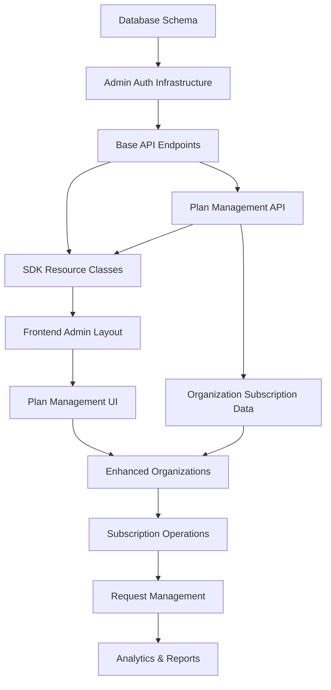
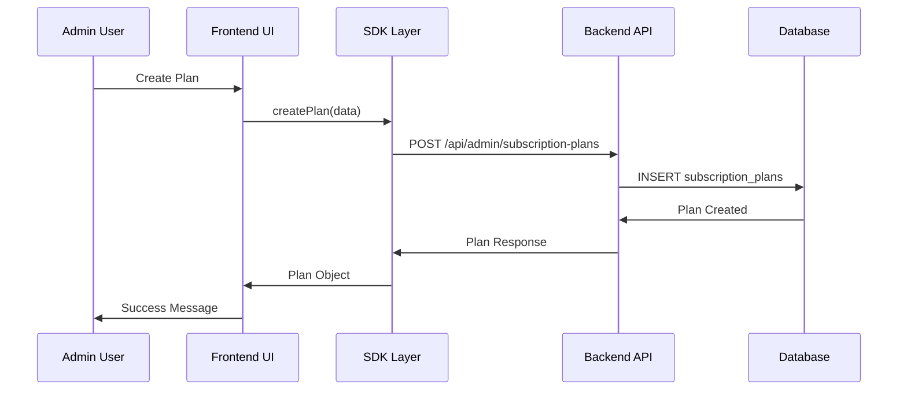
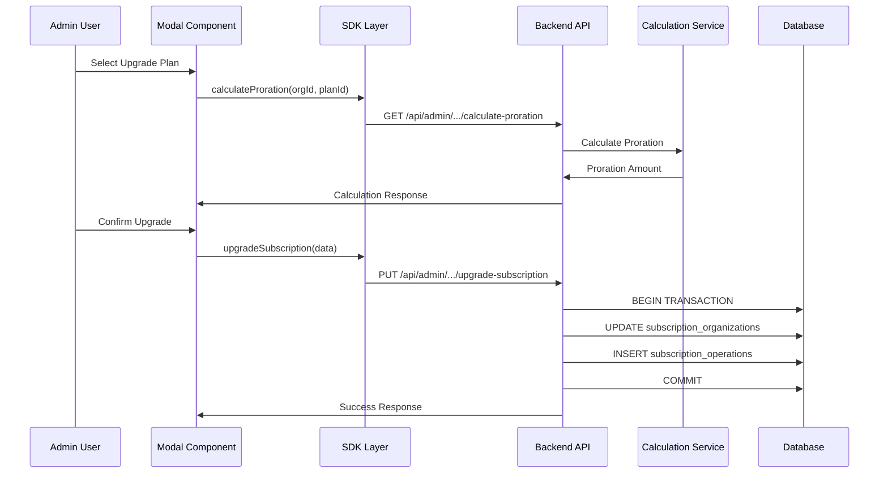
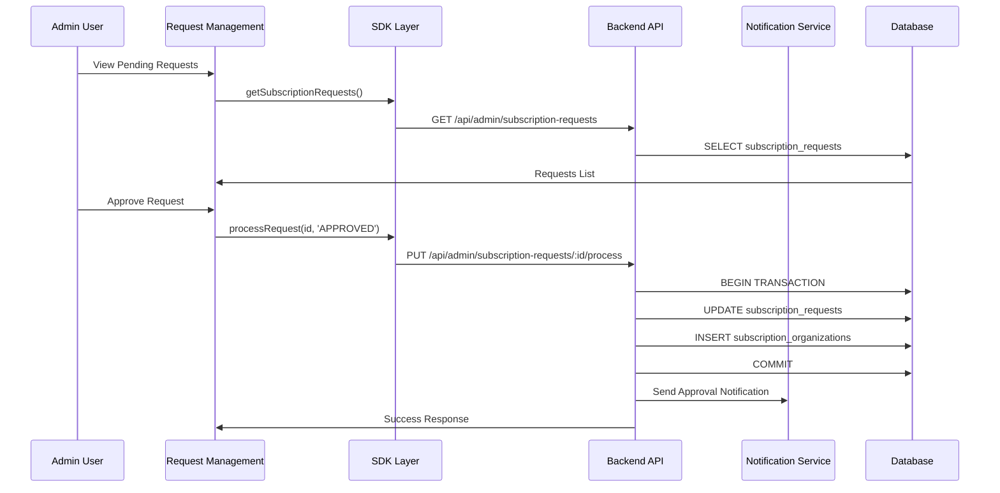

# Subscription Management - Dependency & Integration Map

## 🔗 System Integration Overview

This document maps all dependencies, integration points, and coordination requirements for the subscription management system implementation.

---

## 📊 Dependency Matrix

### Critical Path Dependencies



### Parallel Development Streams

| Stream | Dependencies | Can Start After | Estimated Duration |
|--------|-------------|------------------|-------------------|
| **Database Schema** | None | Immediately | 3 days |
| **Admin Infrastructure** | Database Schema | Day 4 | 4 days |
| **Plan Management** | Admin Infrastructure | Day 8 | 8 days |
| **Organization Enhancement** | Plan Management API | Day 12 | 10 days |
| **Subscription Operations** | Enhanced Organizations | Day 18 | 15 days |
| **Request Management** | Subscription Operations | Day 28 | 8 days |

---

## 🏗️ Technical Integration Points

### 1. Database Layer Integration

#### Schema Dependencies
```sql
-- Primary Dependency Chain
organizations → subscription_organizations → subscription_plans
                     ↓
              subscription_operations
                     ↓
              subscription_cancellations
                     ↓
              subscription_requests
```

#### Foreign Key Constraints
```typescript
interface DatabaseConstraints {
  subscription_requests: {
    organization_id: "organizations.id",
    requested_plan_id: "subscription_plans.id", 
    requested_by: "users.id",
    processed_by: "users.id"
  },
  subscription_operations: {
    organization_id: "organizations.id",
    previous_subscription_id: "subscription_organizations.id",
    new_subscription_id: "subscription_organizations.id",
    processed_by: "users.id"
  },
  subscription_cancellations: {
    organization_id: "organizations.id",
    subscription_id: "subscription_organizations.id",
    processed_by: "users.id"
  }
}
```

### 2. API Layer Integration

#### Endpoint Dependencies
```typescript
// Must exist before dependent endpoints
interface APIDepencies {
  // Foundation
  "POST /api/admin/auth": [], // No dependencies
  "GET /api/admin/subscription-plans": ["admin-auth"],
  
  // Plan Management
  "POST /api/admin/subscription-plans": ["GET plans", "admin-auth"],
  "PUT /api/admin/subscription-plans/:id": ["GET plans", "admin-auth"],
  
  // Organization Enhancement  
  "GET /api/admin/organizations": ["GET plans", "admin-auth"],
  "GET /api/admin/organizations/:id": ["GET organizations", "admin-auth"],
  
  // Complex Operations
  "PUT /api/admin/organizations/:id/upgrade": ["GET organizations", "proration-service"],
  "POST /api/admin/organizations/:id/cancel": ["GET organizations", "cancellation-service"],
  "POST /api/admin/organizations/:id/renew": ["GET organizations", "renewal-service"],
  
  // Request Management
  "GET /api/admin/subscription-requests": ["GET organizations", "GET plans"],
  "PUT /api/admin/subscription-requests/:id/process": ["subscription-operations"]
}
```

### 3. SDK Integration Points

#### Resource Class Dependencies
```typescript
// SDK Resource Dependency Chain
class AdminAuthResource {} // Base - no dependencies

class AdminSubscriptionPlansResource {
  dependencies: [AdminAuthResource]
}

class AdminOrganizationsResource {
  dependencies: [AdminAuthResource, AdminSubscriptionPlansResource]
}

class AdminSubscriptionOperationsResource {
  dependencies: [AdminOrganizationsResource, AdminSubscriptionPlansResource]
}

class AdminSubscriptionRequestsResource {
  dependencies: [AdminOrganizationsResource, AdminSubscriptionPlansResource]
}
```

### 4. Frontend Integration Points

#### Component Dependencies
```typescript
// React Component Dependency Tree
interface ComponentDependencies {
  AdminLayout: [], // Base layout
  
  // Plan Management
  PlanListPage: ["AdminLayout", "PlanService"],
  CreatePlanModal: ["PlanService", "FormPatterns"],
  EditPlanModal: ["PlanService", "FormPatterns"],
  
  // Organization Management
  OrganizationListPage: ["AdminLayout", "OrganizationService", "SubscriptionService"],
  OrganizationDetailPage: ["OrganizationService", "SubscriptionService"],
  
  // Subscription Operations
  UpgradeModal: ["OrganizationService", "SubscriptionService", "ProrationService"],
  CancelModal: ["SubscriptionService", "CancellationService"],
  RenewModal: ["SubscriptionService", "RenewalService"],
  
  // Request Management
  RequestListPage: ["AdminLayout", "RequestService"],
  ApproveRequestModal: ["RequestService", "SubscriptionService"],
  RejectRequestModal: ["RequestService"]
}
```

---

## 🔄 Data Flow Integration

### 1. Plan Management Flow


### 2. Subscription Operation Flow


### 3. Request Processing Flow


---

## 🧩 Service Integration Architecture

### Core Service Dependencies

#### Backend Services
```typescript
interface ServiceDependencies {
  // Foundation Services
  AdminAuthService: [],
  AuditLogService: [],
  ValidationService: [],
  
  // Business Logic Services
  SubscriptionPlanService: ["ValidationService"],
  OrganizationService: ["SubscriptionPlanService"],
  
  // Complex Calculation Services
  ProrationCalculationService: ["SubscriptionPlanService"],
  DateCalculationService: [],
  
  // Operation Services
  SubscriptionOperationService: [
    "OrganizationService",
    "ProrationCalculationService", 
    "DateCalculationService",
    "AuditLogService"
  ],
  
  CancellationService: [
    "OrganizationService",
    "DateCalculationService",
    "AuditLogService"
  ],
  
  RenewalService: [
    "OrganizationService", 
    "SubscriptionPlanService",
    "DateCalculationService",
    "AuditLogService"
  ],
  
  // Workflow Services
  RequestProcessingService: [
    "SubscriptionOperationService",
    "NotificationService",
    "AuditLogService"
  ]
}
```

#### Frontend Service Integration
```typescript
interface FrontendServiceDependencies {
  // Data Services (TanStack Query)
  PlanQueryService: ["AdminAuthHook"],
  OrganizationQueryService: ["AdminAuthHook", "PlanQueryService"],
  SubscriptionQueryService: ["AdminAuthHook", "OrganizationQueryService"],
  RequestQueryService: ["AdminAuthHook"],
  
  // Mutation Services
  PlanMutationService: ["PlanQueryService"],
  SubscriptionMutationService: ["SubscriptionQueryService"],
  RequestMutationService: ["RequestQueryService"],
  
  // UI Services
  ModalStateService: [],
  FormValidationService: [],
  NotificationService: [],
  LoadingStateService: []
}
```

---

## 🔗 External Integration Points

### Third-Party Dependencies

#### Backend Dependencies
```typescript
interface ExternalDependencies {
  // Database
  MySQL: "8.0+",
  TypeORM: "Latest",
  
  // Authentication
  JWT: "Latest",
  bcrypt: "Latest",
  
  // Validation
  "class-validator": "Latest",
  "class-transformer": "Latest",
  
  // Date Handling
  "date-fns": "Latest", // For reliable date calculations
  
  // Financial Calculations
  "decimal.js": "Latest", // For precise currency calculations
  
  // Notifications
  "nodemailer": "Latest" // For email notifications
}
```

#### Frontend Dependencies
```typescript
interface FrontendDependencies {
  // Core Framework
  "Next.js": "Latest",
  "React": "18+",
  
  // State Management
  "@tanstack/react-query": "Latest",
  
  // Forms
  "react-hook-form": "Latest",
  "zod": "Latest",
  
  // UI Components
  "@radix-ui/*": "Latest", // For shadcn/ui base
  "tailwindcss": "Latest",
  
  // Utilities
  "date-fns": "Latest", // Date formatting
  "currency.js": "Latest" // Currency formatting
}
```

### API Integration Points

#### Internal API Dependencies
```typescript
interface InternalAPIDependencies {
  // User Management
  "GET /api/users/me": "Current admin user info",
  "GET /api/users/:id": "User details for request processing",
  
  // Organization Management  
  "GET /api/organizations/:id": "Base organization data",
  "GET /api/organizations/:id/gyms": "Gym count and details",
  
  // Existing Subscription API
  "GET /api/subscriptions/current": "Current subscription status",
  "POST /api/subscriptions/upgrade": "Existing upgrade endpoint (if any)"
}
```

---

## 🔀 Integration Testing Strategy

### Integration Test Phases

#### Phase 1: Database Integration
```typescript
// Required Integration Tests
✅ Foreign key constraint validation
✅ Migration script testing (up/down)
✅ Data integrity during schema changes
✅ Performance impact assessment
```

#### Phase 2: API Integration
```typescript
// API Endpoint Integration
✅ Admin authentication on all endpoints
✅ Permission validation for organization access
✅ Data consistency across related endpoints
✅ Error handling and rollback testing
```

#### Phase 3: SDK Integration
```typescript
// SDK-API Synchronization
✅ Type consistency between API responses and SDK models
✅ Resource method coverage for all API endpoints
✅ Error handling consistency
✅ Authentication token management
```

#### Phase 4: Frontend Integration
```typescript
// UI-SDK Integration
✅ Form validation matching API validation
✅ Error message consistency
✅ Loading state management
✅ Optimistic updates and rollback
```

#### Phase 5: End-to-End Integration
```typescript
// Complete Workflow Testing
✅ Plan creation to organization assignment
✅ Subscription upgrade with proration calculation
✅ Request approval workflow
✅ Cancellation and renewal processes
```

---

## 🚨 Integration Risk Points

### High-Risk Integration Areas

#### 1. Financial Calculation Consistency
**Risk**: Proration calculations differ between frontend display and backend processing
**Integration Point**: ProrationModal ↔ ProrationCalculationService
**Mitigation**: 
- Real-time calculation API calls for display
- Identical calculation logic in frontend and backend
- Integration tests for calculation consistency

#### 2. Transaction Boundary Management
**Risk**: Partial updates leaving system in inconsistent state
**Integration Point**: SubscriptionOperationService ↔ Database
**Mitigation**:
- Database transactions for all multi-table operations
- Rollback procedures for failed operations
- Integrity constraint validation

#### 3. Permission Escalation
**Risk**: Frontend bypassing backend permission checks
**Integration Point**: Frontend Components ↔ Admin API Endpoints
**Mitigation**:
- Backend validation on every request
- Frontend permission checks for UX only
- Regular security audit of permission logic

#### 4. Date/Time Consistency
**Risk**: Time zone and date calculation inconsistencies
**Integration Point**: DateCalculationService ↔ Frontend Date Display
**Mitigation**:
- UTC storage with timezone-aware display
- Consistent date libraries (date-fns) across stack
- Integration tests for date boundary conditions

---

## 📋 Integration Checklist

### Pre-Development Checklist
- [ ] All external dependencies available and compatible
- [ ] Database migration scripts tested in staging
- [ ] Authentication middleware tested with existing system
- [ ] SDK patterns established and documented

### Development Phase Checkpoints
- [ ] API endpoints return expected response format
- [ ] SDK resources match API response types exactly
- [ ] Frontend forms validate consistently with backend
- [ ] Error handling works across all layers

### Pre-Production Checklist
- [ ] All integration tests passing
- [ ] Performance benchmarks met
- [ ] Security audit completed
- [ ] Rollback procedures tested
- [ ] Monitoring and alerting configured

---

## 🎯 Success Criteria

### Integration Success Metrics
1. **Type Safety**: 100% TypeScript compilation without `any` types
2. **API Consistency**: 0% variance between API documentation and implementation
3. **Error Handling**: Consistent error messages across all layers
4. **Performance**: <200ms end-to-end response time for standard operations
5. **Data Integrity**: 0% data inconsistency issues in integration tests

### Quality Gates
- **Daily**: SDK-API type consistency validation
- **Sprint End**: Full integration test suite passing
- **Pre-Production**: Security and performance validation
- **Post-Deployment**: Monitoring and alerting verification

This integration map ensures all components work together seamlessly and provides clear coordination points for the development team.