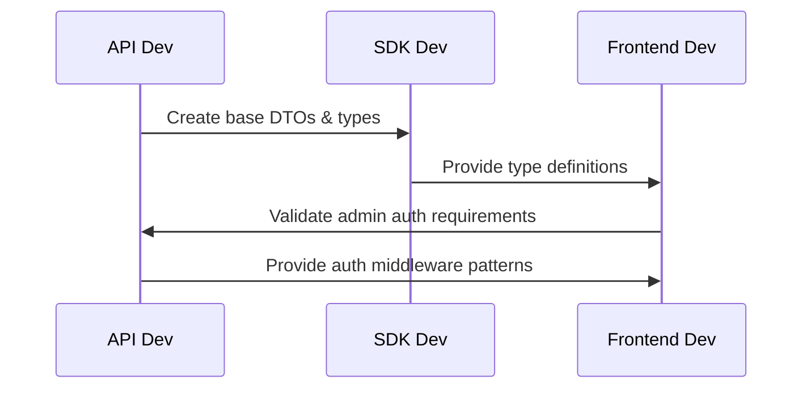

# Subscription Management System - Implementation Workflow

## 📋 Executive Summary

Comprehensive 6-sprint implementation plan for the GymSpace subscription management system, focusing on admin web interfaces and backend API with modal-based UX. Total effort: 72 developer days across backend/frontend development.

**Scope**: `packages/web` (admin interfaces) + `packages/api` (admin endpoints) + `packages/sdk` (synchronization)
**No Changes**: `packages/mobile` (excluded from this phase)

---

## 🏗️ Implementation Strategy

### Core Principles
- **Risk-First Development**: Tackle complex calculations and transaction logic early
- **Incremental Delivery**: Each sprint delivers working functionality
- **Agent Coordination**: Parallel development with clear integration points
- **Modal-First UI**: Standardize interaction patterns early

### Quality Gates
- **Phase Gates**: Validation checkpoints between major phases
- **Integration Points**: API-SDK-Frontend synchronization validation
- **Risk Validation**: Extensive testing for financial/date calculations
- **Security Audit**: Admin permission and audit logging verification

---

## 📅 Sprint Breakdown (6 Sprints × 2 Weeks)

## Sprint 1: Foundation & Database (Weeks 1-2)
**Theme**: Critical infrastructure and data foundation

### 🎯 Sprint Goals
- Establish database schema for all subscription operations
- Create admin authentication and permission framework
- Set up base API infrastructure with admin route patterns

### 📊 Effort Distribution
- **Backend**: 7 days (Database schema, auth middleware, base DTOs)
- **Frontend**: 3 days (Admin layout structure, base patterns)
- **Integration**: 2 days (SDK base updates, testing framework)

### 🔧 Deliverables

#### Database Schema (Gymspace API SDK Developer)
```sql
-- Priority 1: Core Tables
✅ subscription_requests table
✅ subscription_operations table  
✅ subscription_cancellations table
✅ Modify subscription_plans (add is_public, sort_order)
✅ Modify subscription_organizations (add cancellation_id)

-- Migration Strategy
✅ Forward migration scripts
✅ Rollback procedures
✅ Data integrity constraints
```

#### Backend Infrastructure (Gymspace API SDK Developer)
```typescript
// Admin Authentication & Security
✅ AdminAuthGuard middleware
✅ Permission validation decorators
✅ Audit logging infrastructure
✅ Base admin controller patterns

// Core DTOs & Validators
✅ CreatePlanDto, UpdatePlanDto
✅ SubscriptionRequestDto
✅ OperationRequestDto, CancellationDto
```

#### Frontend Foundation (Frontend Web Expert)
```typescript
// Admin Layout System
✅ /admin layout with authentication
✅ Admin navigation structure  
✅ Base modal component patterns
✅ Form validation patterns with zod

// Development Patterns
✅ TanStack Query setup for admin operations
✅ Error handling patterns
✅ Loading state management
```

#### SDK Synchronization (Gymspace API SDK Developer)
```typescript
// Base Resource Classes
✅ AdminSubscriptionPlansResource
✅ AdminOrganizationsResource
✅ AdminSubscriptionRequestsResource
```

### 🔍 Sprint 1 Validation Criteria
- [ ] Database migrations run successfully in dev/staging
- [ ] Admin authentication blocks non-admin users
- [ ] Base API endpoints return 404 (routes exist but not implemented)
- [ ] Frontend admin layout renders with placeholder content
- [ ] SDK types compile without errors

---

## Sprint 2: Plan Management (Weeks 3-4)
**Theme**: Complete CRUD operations for subscription plans

### 🎯 Sprint Goals
- Full plan management functionality for administrators
- Modal-based plan creation and editing
- Admin-only plan visibility controls

### 📊 Effort Distribution
- **Backend**: 4 days (Plan CRUD, validation, business logic)
- **Frontend**: 5 days (Plans page, modals, forms)
- **Testing**: 3 days (Unit tests, integration tests)

### 🔧 Deliverables

#### Plan Management API (Gymspace API SDK Developer)
```typescript
// Admin Plan Endpoints
✅ GET /api/admin/subscription-plans (with hidden plans)
✅ POST /api/admin/subscription-plans
✅ GET /api/admin/subscription-plans/:id
✅ PUT /api/admin/subscription-plans/:id  
✅ DELETE /api/admin/subscription-plans/:id

// Business Logic
✅ Plan validation service
✅ Unique name validation
✅ Pricing validation by currency
✅ Feature list management
```

#### Plan Management UI (Frontend Web Expert)
```typescript
// Pages & Components
✅ /admin/plans/page.tsx (plan listing)
✅ CreatePlanModal.tsx (full form with validation)
✅ EditPlanModal.tsx (edit existing plan)
✅ Plan filtering and search

// Features
✅ Multi-currency pricing forms
✅ Feature list management
✅ Visibility toggle (public/hidden)
✅ Real-time validation
```

#### SDK Resources (Gymspace API SDK Developer)
```typescript
// AdminSubscriptionPlansResource
✅ createPlan(data: CreatePlanDto)
✅ updatePlan(id: string, data: UpdatePlanDto)
✅ deletePlan(id: string)
✅ getAllPlans(includeHidden: boolean)
```

### 🔍 Sprint 2 Validation Criteria
- [ ] Administrators can create, edit, delete plans
- [ ] Plan validation prevents duplicate names
- [ ] Multi-currency pricing works correctly
- [ ] Hidden plans are not visible to non-admins
- [ ] Modal forms handle all edge cases

---

## Sprint 3: Enhanced Organizations (Weeks 5-6)
**Theme**: Organization listing with subscription data and action buttons

### 🎯 Sprint Goals
- Migrate from `/organizations` to `/admin/organizations`
- Display subscription status, usage, and limits
- Add action buttons for subscription operations (UI only)

### 📊 Effort Distribution
- **Backend**: 5 days (Enhanced org API, usage calculations)
- **Frontend**: 6 days (Enhanced listing, action buttons, detailed view)
- **Testing**: 2 days (Data aggregation tests)

### 🔧 Deliverables

#### Enhanced Organization API (Gymspace API SDK Developer)
```typescript
// Enhanced Organization Endpoints
✅ GET /api/admin/organizations?include=subscription,usage
✅ GET /api/admin/organizations/:id?include=gyms,stats
✅ Organization usage calculation service
✅ Subscription status aggregation

// Data Models
✅ OrganizationWithSubscription interface
✅ UsageCalculation service
✅ SubscriptionStatus calculation
```

#### Organization Management UI (Frontend Web Expert)
```typescript
// Pages & Components
✅ /admin/organizations/page.tsx (enhanced listing)
✅ /admin/organizations/[id]/page.tsx (detailed view)
✅ Organization filtering and search
✅ Usage vs limits visualization

// Action Buttons (UI Only - functionality in Sprint 4)
✅ Upgrade/Downgrade button
✅ Cancel Subscription button  
✅ Renew Subscription button
✅ View Details button
```

#### Organization Detail View (Frontend Web Expert)
```typescript
// Detailed Organization View
✅ Organization info section
✅ Current subscription details
✅ Gyms list with metrics
✅ Usage statistics and charts
✅ Subscription history timeline
```

### 🔍 Sprint 3 Validation Criteria
- [ ] Organization listing shows subscription data
- [ ] Usage calculations are accurate
- [ ] Action buttons are visible but show "coming soon"
- [ ] Organization detail view displays comprehensive info
- [ ] Filtering and search work correctly

---

## Sprint 4: Subscription Operations (Weeks 7-8)
**Theme**: Complex subscription operations with financial calculations

⚠️ **HIGH RISK SPRINT** - Contains most complex business logic

### 🎯 Sprint Goals
- Implement upgrade/downgrade with prorating
- Cancellation system with immediate/end-of-period options
- Renewal system with custom durations

### 📊 Effort Distribution
- **Backend**: 10 days (Complex business logic, transaction handling)
- **Frontend**: 8 days (Operation modals, validation, UX)
- **Testing**: 5 days (Extensive testing for financial calculations)

### 🔧 Deliverables

#### Core Subscription Operations (Gymspace API SDK Developer)
```typescript
// Complex Business Logic Services
✅ ProrationCalculationService
✅ SubscriptionTransitionService  
✅ DateCalculationUtility
✅ TransactionManager for subscription changes

// Critical API Endpoints
✅ PUT /api/admin/organizations/:id/upgrade-subscription
✅ POST /api/admin/organizations/:id/cancel-subscription
✅ POST /api/admin/organizations/:id/renew-subscription
✅ GET /api/admin/organizations/:id/calculate-proration
```

#### Subscription Operation Modals (Frontend Web Expert)
```typescript
// Complex Modal Components
✅ UpgradeSubscriptionModal.tsx
   - Plan comparison view
   - Proration calculation display
   - Payment amount configuration
   - Date selection (immediate vs end-of-period)

✅ CancelSubscriptionModal.tsx
   - Cancellation type selection
   - Reason requirement
   - Impact warnings
   - Confirmation flow

✅ RenewSubscriptionModal.tsx
   - Duration customization
   - Plan change option during renewal
   - Payment configuration
   - Start date selection
```

#### Financial Calculation Engine (Gymspace API SDK Developer)
```typescript
// High-Risk Components - Requires Extensive Testing
✅ ProrationCalculationService
   - Daily proration for upgrades
   - Refund calculation for downgrades
   - Currency precision handling
   - Time zone aware calculations

✅ SubscriptionDateManager
   - Subscription period calculations
   - End date determination
   - Grace period handling
   - Billing cycle alignment
```

### 🔍 Sprint 4 Validation Criteria
- [ ] Proration calculations are mathematically correct
- [ ] Subscription transitions maintain data integrity
- [ ] Cancellation respects immediate vs end-of-period logic
- [ ] Renewal extends dates correctly
- [ ] All operations create proper audit trails

### 🚨 Risk Mitigation for Sprint 4

#### Financial Calculation Testing
```typescript
// Required Test Coverage
✅ Unit tests for proration edge cases
✅ Integration tests for date calculations
✅ Currency precision validation
✅ Time zone handling verification
✅ Business rule validation tests
```

#### Transaction Integrity
```typescript
// Database Transaction Strategy
✅ Atomic subscription updates
✅ Rollback procedures for failed operations
✅ Optimistic locking for concurrent access
✅ Audit trail for all changes
```

---

## Sprint 5: Request Management (Weeks 9-10)
**Theme**: Subscription request approval workflow

### 🎯 Sprint Goals
- Request management interface for administrators
- Approval/rejection workflow with notifications
- Request status tracking and history

### 📊 Effort Distribution
- **Backend**: 6 days (Request processing, workflow logic)
- **Frontend**: 5 days (Request management UI, approval modals)
- **Testing**: 2 days (Workflow testing)

### 🔧 Deliverables

#### Request Management API (Gymspace API SDK Developer)
```typescript
// Request Workflow Endpoints
✅ GET /api/admin/subscription-requests
✅ PUT /api/admin/subscription-requests/:id/process
✅ POST /api/subscription-requests (for future mobile use)

// Workflow Logic
✅ RequestProcessingService
✅ NotificationService for status updates
✅ Request status transition validation
```

#### Request Management UI (Frontend Web Expert)
```typescript
// Request Management Interface
✅ /admin/subscription-requests/page.tsx
✅ ApproveRequestModal.tsx
✅ RejectRequestModal.tsx
✅ Request filtering by status/date
✅ Bulk action capabilities
```

### 🔍 Sprint 5 Validation Criteria
- [ ] Administrators can approve/reject requests
- [ ] Request status updates correctly
- [ ] Approval creates new subscription
- [ ] Rejection includes admin comments
- [ ] Notifications work correctly

---

## Sprint 6: Polish & Detail Views (Weeks 11-12)
**Theme**: Enhanced UX, reporting, and production readiness

### 🎯 Sprint Goals
- Subscription history and audit trails
- Advanced organization analytics
- Performance optimization and polish
- Production deployment preparation

### 📊 Effort Distribution
- **Backend**: 3 days (History endpoints, performance optimization)
- **Frontend**: 4 days (Analytics, history views, UX polish)
- **Testing & Deployment**: 5 days (E2E tests, performance testing, deployment)

### 🔧 Deliverables

#### Analytics & History (Gymspace API SDK Developer)
```typescript
// Advanced Endpoints
✅ GET /api/admin/organizations/:id/subscription-history
✅ GET /api/admin/subscription-analytics
✅ GET /api/admin/revenue-reports

// Performance Optimization
✅ Query optimization for large datasets
✅ Caching strategy for admin dashboards
✅ Database indexing optimization
```

#### Advanced UI Features (Frontend Web Expert)
```typescript
// Enhanced UX
✅ Subscription history timeline
✅ Organization analytics dashboard
✅ Advanced filtering and search
✅ Export capabilities
✅ Responsive design optimization

// Production Polish
✅ Error boundary implementation
✅ Loading state optimization
✅ Performance monitoring
✅ Accessibility improvements
```

### 🔍 Sprint 6 Validation Criteria
- [ ] All features work in production environment
- [ ] Performance meets SLA requirements (<200ms)
- [ ] Analytics provide actionable insights
- [ ] Export functions work correctly
- [ ] System handles concurrent admin users

---

## 🤝 Agent Coordination Strategy

### Frontend Web Expert & Gymspace API SDK Developer Coordination

#### Phase 1: Foundation (Sprint 1)


#### Phase 2-6: Parallel Development with Integration Points
```typescript
// Daily Coordination Protocol
✅ Daily standup with integration status
✅ API-first development (endpoints before UI)
✅ SDK synchronization after each API change
✅ Frontend integration testing after SDK updates

// Integration Checkpoints
✅ End of each sprint: Full integration testing
✅ Mid-sprint: API contract validation
✅ Feature completion: E2E workflow testing
```

### Communication Protocol
1. **API-First**: Backend completes endpoints before frontend work
2. **SDK Sync**: Immediate SDK updates after API changes
3. **Integration Testing**: Daily integration validation
4. **Blocker Resolution**: Immediate escalation for blocking issues

---

## 🔒 Security & Audit Requirements

### Admin Security Framework
```typescript
// Required Security Measures
✅ Role-based access control for all admin routes
✅ Organization ownership validation
✅ Audit logging for all subscription operations
✅ Input validation and sanitization
✅ Rate limiting on admin endpoints

// Audit Trail Requirements
✅ Log all subscription changes with admin ID
✅ Track financial operations with amounts
✅ Record approval/rejection decisions
✅ Maintain operation timestamps and reasons
```

### Compliance Considerations
- **Data Privacy**: Admin access logging for GDPR compliance
- **Financial Accuracy**: Audit trail for financial operations
- **User Consent**: Track admin-initiated changes vs user requests

---

## 📊 Success Metrics & Validation

### Functional Metrics
- **Plan Management**: 100% CRUD operations working
- **Organization Operations**: 95% success rate for subscription changes
- **Request Processing**: <24 hour average approval time
- **Data Accuracy**: 0% financial calculation errors

### Technical Metrics
- **Performance**: <200ms response time for admin operations
- **Reliability**: 99.9% uptime for admin interface
- **Security**: 0 unauthorized access attempts successful
- **Code Quality**: >80% test coverage for business logic

### User Experience Metrics
- **Admin Efficiency**: 50% reduction in subscription management time
- **Error Reduction**: 90% fewer support tickets for subscription issues
- **Feature Adoption**: 80% of eligible organizations using new features within 30 days

---

## 🚨 Risk Management & Contingency Plans

### High Risk Areas

#### 1. Financial Calculation Accuracy
**Risk**: Incorrect proration or date calculations
**Mitigation**: 
- Extensive unit testing with edge cases
- External audit of calculation logic
- Staged rollout with manual verification

#### 2. Database Transaction Integrity
**Risk**: Partial updates leaving inconsistent state
**Mitigation**:
- Atomic transactions for all operations
- Rollback procedures for failed operations
- Database constraints preventing orphaned records

#### 3. Admin Permission Escalation
**Risk**: Unauthorized access to admin functions
**Mitigation**:
- Multi-layer permission validation
- Audit logging of all admin actions
- Regular security audits and penetration testing

### Contingency Plans

#### Schedule Delays
- **Trigger**: >20% variance from sprint timeline
- **Response**: Scope reduction prioritizing core functionality
- **Fallback**: Phase 1-3 delivery as MVP, defer advanced features

#### Technical Blockers
- **Trigger**: Blocker lasting >2 days
- **Response**: Immediate escalation and alternative solution exploration
- **Fallback**: Temporary workarounds to maintain sprint momentum

#### Quality Issues
- **Trigger**: >5% test failure rate or critical bugs
- **Response**: Feature freeze and bug fix sprint
- **Fallback**: Rollback to previous stable version

---

## 🎯 Next Steps & Immediate Actions

### Week 1 Immediate Tasks

#### For Team Lead
1. **Agent Assignment**: Assign Frontend Web Expert and Gymspace API SDK Developer agents
2. **Environment Setup**: Ensure development environments are ready
3. **Database Access**: Prepare staging database for migration testing

#### For Gymspace API SDK Developer
1. **Database Design Review**: Validate proposed schema changes
2. **Migration Planning**: Create migration scripts and rollback procedures
3. **Admin Auth Setup**: Implement base authentication middleware

#### For Frontend Web Expert  
1. **Route Planning**: Plan admin route structure and navigation
2. **Component Architecture**: Design modal component hierarchy
3. **Design System Review**: Ensure shadcn/ui patterns are ready

### Pre-Sprint 1 Checklist
- [ ] Development environment setup complete
- [ ] Database migration scripts reviewed and tested
- [ ] Admin authentication strategy confirmed
- [ ] Component design patterns established
- [ ] Sprint 1 backlog refined and estimated
- [ ] Definition of done criteria established

---

## 📚 Documentation & Knowledge Transfer

### Required Documentation
1. **API Documentation**: Complete Swagger documentation for all admin endpoints
2. **Component Library**: Documentation for all modal components and patterns
3. **Database Schema**: Complete ERD and migration documentation
4. **Business Logic**: Documentation for complex calculation algorithms
5. **Security Guidelines**: Admin access patterns and security requirements

### Knowledge Transfer Sessions
- **Week 2**: Database schema and migration strategy
- **Week 4**: API patterns and business logic
- **Week 6**: Frontend patterns and modal architecture
- **Week 8**: Complex subscription operations
- **Week 10**: Request workflow and approval process
- **Week 12**: Production deployment and monitoring

This comprehensive workflow provides the structure needed for successful implementation of the subscription management system while managing complexity and coordinating multiple development streams.