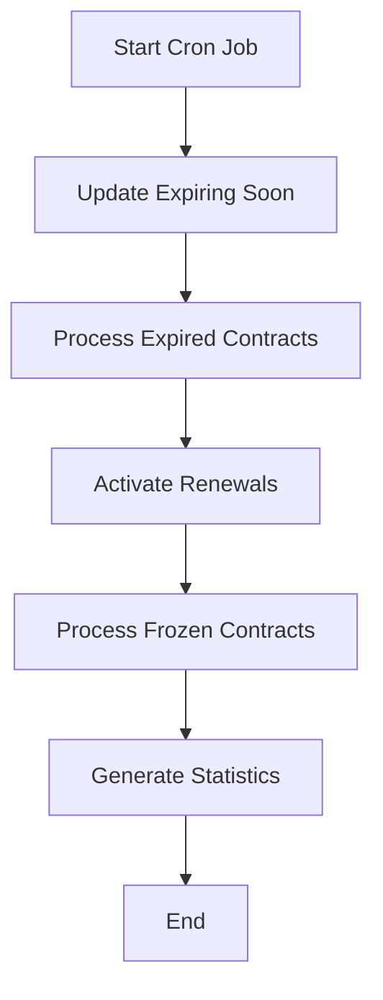

# Contract Lifecycle Management System

## Overview

The contract lifecycle management system automatically handles contract state transitions, renewals, and freezing/unfreezing operations. The system runs twice daily (8 AM and 8 PM) via a cron job to ensure contracts are always in the correct state.

## Contract States

```typescript
enum ContractStatus {
  active        // Contract is currently valid and in use
  expiring_soon // Contract will expire within 7 days
  expired       // Contract has passed its end date
  frozen        // Contract is temporarily suspended
  pending       // Contract is created but not yet active (used for renewals)
}
```

## Core Processes

### 1. Contract Expiration Process

The expiration process follows a predictable timeline:

```
Timeline:
-30 days    Contract starts (active)
-7 days     Contract marked as expiring_soon
0 days      Contract expires (expired)
```

#### Expiring Soon Detection
- **Trigger**: Contract end date is within 7 days from today
- **Conditions**: 
  - Current status must be `active`
  - End date must be between today and 7 days from now
  - Contract must not be deleted
- **Action**: Status changes from `active` → `expiring_soon`

```typescript
// Example: Contract expiring on Jan 7th
// On Jan 1st: Status changes from 'active' to 'expiring_soon'
if (contract.status === 'active' && 
    contract.endDate >= today && 
    contract.endDate <= sevenDaysFromNow) {
  contract.status = 'expiring_soon';
}
```

#### Contract Expiration
- **Trigger**: Contract end date has passed
- **Conditions**:
  - Current status is `active` or `expiring_soon`
  - End date is before today
  - Contract must not be deleted
- **Action**: Status changes to `expired`

```typescript
// Example: Contract with endDate of Dec 31st
// On Jan 1st: Status changes to 'expired'
if ((contract.status === 'active' || contract.status === 'expiring_soon') &&
    contract.endDate < today) {
  contract.status = 'expired';
}
```

### 2. Contract Renewal Process

Renewals allow clients to continue their membership after a contract expires. The renewal system is designed to be seamless and automatic when payment is received.

#### Creating a Renewal
1. **Manual Creation**: Staff creates a renewal contract before the current contract expires
2. **Status**: New renewal starts with `pending` status
3. **Relationship**: Renewal is linked to parent contract via `parentId`
4. **Dates**: Renewal has its own start and end dates (typically starting when parent expires)

```typescript
// Renewal structure
{
  id: "renewal-123",
  parentId: "contract-456",  // Links to original contract
  status: "pending",          // Waiting for activation
  startDate: "2025-01-01",    // When parent expires
  endDate: "2025-01-31",      // New contract period
  finalAmount: 100.00,        // Payment amount
}
```

#### Renewal Activation
- **Trigger**: Parent contract becomes `expired`
- **Conditions**:
  - Parent contract status is `expired`
  - Renewal status is `pending`
  - Renewal has payment (`finalAmount > 0`)
  - Renewal is not deleted
- **Action**: Renewal status changes from `pending` → `active`

```typescript
// Activation flow
1. Parent contract expires
2. System finds pending renewals for expired contracts
3. If renewal has payment (finalAmount > 0):
   - Renewal becomes active
   - Client continues with new contract
4. If renewal has no payment:
   - Renewal stays pending
   - Client has no active contract
```

#### Important Notes on Renewals
- Only ONE pending renewal should exist per contract
- Renewals are processed in order of creation (newest first)
- Unpaid renewals (`finalAmount = 0`) remain pending indefinitely
- Active renewals become regular contracts and follow the same lifecycle

### 3. Contract Freezing Process

Freezing allows temporary suspension of contracts (e.g., for vacations, medical leave). The contract duration is effectively extended by the freeze period.

#### Freezing a Contract
1. **Manual Action**: Staff freezes an active contract
2. **Status Change**: `active` → `frozen`
3. **Required Fields**:
   - `freezeStartDate`: When the freeze begins
   - `freezeEndDate`: When the freeze should end
4. **Effect**: Contract is suspended, client cannot use services

```typescript
// Freeze structure
{
  status: "frozen",
  freezeStartDate: "2025-01-01",  // Freeze begins
  freezeEndDate: "2025-01-15",    // Freeze ends (14 days)
  endDate: "2025-02-14",          // Extended by freeze duration
}
```

#### Automatic Reactivation
- **Trigger**: Current date passes `freezeEndDate`
- **Conditions**:
  - Status is `frozen`
  - `freezeEndDate` is not null
  - `freezeEndDate` <= today
- **Action**: 
  - Status changes from `frozen` → `active`
  - `freezeStartDate` and `freezeEndDate` are cleared
  - Contract continues with extended end date

```typescript
// Reactivation example
// Contract frozen from Jan 1-15
// On Jan 16: Automatically reactivates
if (contract.status === 'frozen' && 
    contract.freezeEndDate <= today) {
  contract.status = 'active';
  contract.freezeStartDate = null;
  contract.freezeEndDate = null;
}
```

#### Freeze Duration Calculation
When a contract is frozen, its end date should be extended by the freeze duration:

```typescript
const freezeDuration = freezeEndDate - freezeStartDate;
const newEndDate = originalEndDate + freezeDuration;
```

## Cron Job Execution Flow

The system runs every 12 hours with the following sequence:



### Detailed Execution Steps

1. **Update Expiring Soon Contracts** (`updateExpiringSoonContracts`)
   - Find active contracts ending within 7 days
   - Update status to `expiring_soon`
   - Log count of updated contracts

2. **Process Expired Contracts** (`processExpiredContracts`)
   - Find contracts that should be expired
   - Update status to `expired`
   - Track errors for individual contracts

3. **Activate Renewals** (within `processExpiredContracts`)
   - Find all expired contracts with pending renewals
   - Check if renewal has payment
   - Activate paid renewals
   - Log unpaid renewals

4. **Process Frozen Contracts** (`processFrozenContracts`)
   - Find frozen contracts with `freezeEndDate`
   - Reactivate contracts where freeze period has ended
   - Count still-frozen contracts
   - Track any errors

5. **Generate Final Statistics** (`getContractStatusStats`)
   - Count contracts by status
   - Identify contracts needing updates
   - Return comprehensive statistics

## Example Scenarios

### Scenario 1: Normal Contract Lifecycle
```
Day 1:   Contract created (active, ends in 30 days)
Day 23:  Contract marked as expiring_soon (7 days left)
Day 30:  Contract expires
Day 30:  If renewal exists with payment → Renewal activates
```

### Scenario 2: Contract with Freeze
```
Day 1:   Contract created (active, ends in 30 days)
Day 10:  Contract frozen for 7 days
Day 17:  Contract automatically reactivates
Day 30:  Contract marked as expiring_soon (original 30 days)
Day 37:  Contract expires (extended by 7-day freeze)
```

### Scenario 3: Renewal Without Payment
```
Day 25:  Renewal created (pending, no payment)
Day 30:  Parent contract expires
Day 30:  Renewal stays pending (no payment)
Day 35:  Payment received, manual activation needed
```

## Output Structure

The cron job returns a detailed JSON structure:

```json
{
  "success": true,
  "timestamp": "2025-01-01T08:00:00.000Z",
  "expiringSoon": {
    "processed": true,
    "count": 5  // Contracts marked as expiring_soon
  },
  "expired": {
    "processed": true,
    "expiredCount": 3,      // Contracts marked as expired
    "renewalsActivated": 2,  // Renewals that became active
    "errors": []            // Any processing errors
  },
  "frozen": {
    "processed": true,
    "reactivatedCount": 1,   // Frozen contracts reactivated
    "stillFrozenCount": 4,   // Contracts still frozen
    "errors": []
  },
  "finalStats": {
    "active": 50,           // Total active contracts
    "expiringSoon": 5,      // Total expiring soon
    "expired": 20,          // Total expired
    "frozen": 4,            // Total frozen
    "total": 79,            // All contracts
    "needsUpdate": {
      "expiringSoon": 0,    // Contracts that should be expiring_soon
      "expired": 0,         // Contracts that should be expired
      "total": 0
    }
  }
}
```

## Testing the System

### Using the Test Seed Command

```bash
# Create test contracts with various scenarios
pnpm run cli seed:contracts:test

# Manually trigger the lifecycle handler
pnpm run cli trigger:contract:lifecycle

# Check the output matches expected results
```

### Test Scenarios Created
1. Active contract → Will become expiring_soon
2. Active contract → Will expire
3. Expiring_soon contract → Will expire
4. Expired contract with paid renewal → Renewal will activate
5. Expired contract with unpaid renewal → Renewal stays pending
6. Frozen contract (freeze ended) → Will reactivate
7. Frozen contract (freeze ongoing) → Stays frozen
8. Active contract → Stays active

## Important Considerations

### Business Rules
1. **Grace Period**: Currently no grace period after expiration
2. **Multiple Renewals**: Only the latest pending renewal is activated
3. **Freeze Limits**: No maximum freeze duration enforced
4. **Payment Validation**: Only checks `finalAmount > 0`

### Performance Considerations
- Contracts are processed individually to avoid memory issues
- Each operation is logged for debugging
- Errors are captured but don't stop the entire process
- Statistics are calculated after all updates

### Edge Cases Handled
- Contracts without end dates are skipped
- Deleted contracts (`deletedAt != null`) are ignored
- Null freeze dates don't cause errors
- Missing renewal amounts default to 0

## Future Improvements

Potential enhancements to consider:

1. **Grace Period**: Add configurable grace period after expiration
2. **Notifications**: Send alerts for expiring contracts
3. **Bulk Operations**: Process contracts in batches for better performance
4. **Audit Trail**: Track all status changes with timestamps
5. **Flexible Scheduling**: Allow gym-specific cron schedules
6. **Renewal Reminders**: Automated reminders before expiration
7. **Freeze Validation**: Maximum freeze duration limits
8. **Payment Integration**: Direct payment status checks