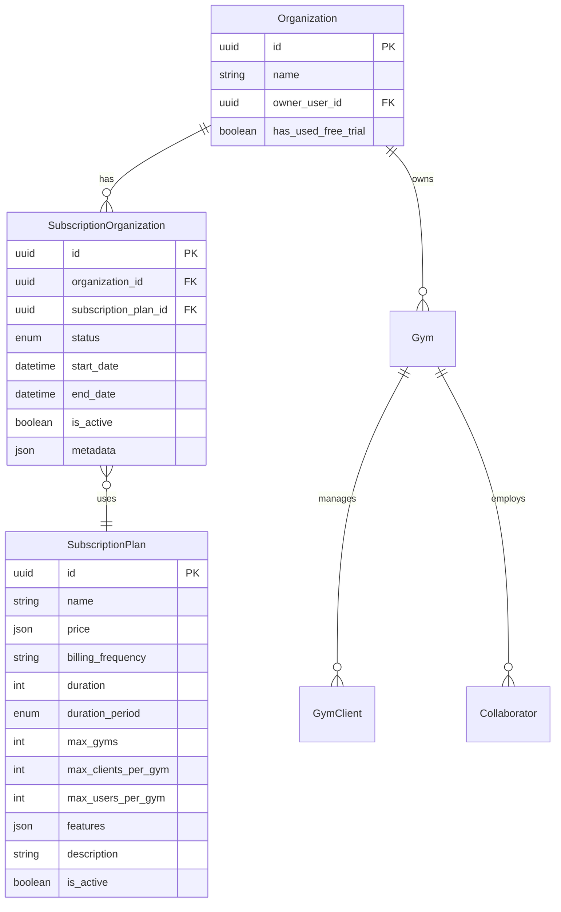

# Organizations & Subscriptions Module

## Overview

The Subscriptions module manages the subscription plans and organizational subscriptions for the GymSpace multi-tenant SaaS platform. It handles plan management, subscription lifecycle, usage limits enforcement, and integration with the organization hierarchy.

## Architecture

### Database Schema



### Module Structure

```
packages/api/src/modules/subscriptions/
├── subscriptions.module.ts       # Module configuration
├── subscriptions.controller.ts   # HTTP endpoints
├── subscriptions.service.ts      # Business logic
└── dto/
    ├── affiliate-organization.dto.ts
    ├── available-plans.dto.ts
    ├── subscription-status.dto.ts
    ├── subscription-expiration-check.dto.ts
    └── upgrade-subscription.dto.ts
```

## Core Concepts

### Subscription Plans

Plans define the features and limits available to organizations:

- **Pricing**: Multi-currency support (USD, COP, MXN, USD_EC)
- **Billing Frequency**: monthly, quarterly, annual
- **Duration**: Optional trial period configuration
- **Limits**:
  - `maxGyms`: Maximum number of gyms per organization
  - `maxClientsPerGym`: Maximum clients per gym
  - `maxUsersPerGym`: Maximum users/collaborators per gym
- **Features**: JSON configuration for feature toggles

### Subscription Organizations

The active subscription for an organization:

- **Unique Active Constraint**: Only one active subscription per organization
- **Status Management**: active, inactive, expired, paused, pending_upgrade
- **Trial Period**: 30-day free trial for free plans
- **Automatic Expiration**: Based on end_date comparison

### Free Plan Logic

Free plans are identified by zero pricing across all currencies:

```typescript
private isFreePlan(price: any): boolean {
  if (!price || typeof price !== 'object') {
    return true;
  }
  
  return Object.values(price).every((priceInfo: any) => {
    if (typeof priceInfo === 'object' && priceInfo !== null) {
      return priceInfo.value === 0;
    }
    return priceInfo === 0;
  });
}
```

## API Endpoints

### 1. Get Available Plans
**GET** `/api/v1/subscriptions/plans`

Returns all active subscription plans available for selection.

**Response**: `AvailablePlanDto[]`
```typescript
{
  id: string;
  name: string;
  description: string | null;
  price: {
    USD: { currency: 'USD', value: 0 },
    COP: { currency: 'COP', value: 0 }
  };
  billingFrequency: string;
  maxGyms: number;
  maxClientsPerGym: number;
  maxUsersPerGym: number;
  features: any;
  isFreePlan: boolean;
}
```

### 2. Get Subscription Status
**GET** `/api/v1/subscriptions/organizations/:organizationId/status`

Returns current subscription status and usage for an organization.

**Authorization**: Owner or collaborator of the organization

**Response**: `SubscriptionStatusDto`
```typescript
{
  organizationId: string;
  subscriptionPlan: {
    id: string;
    name: string;
    price: any;
    billingFrequency: string;
    maxGyms: number;
    maxClientsPerGym: number;
    maxUsersPerGym: number;
    features: any;
  };
  status: SubscriptionStatus;
  subscriptionStart: Date;
  subscriptionEnd: Date;
  daysRemaining: number;
  isExpired: boolean;
  isFreePlan: boolean;
  usage: {
    gyms: number;
    totalClients: number;
    totalUsers: number;
  };
  limits: {
    maxGyms: number;
    maxClientsPerGym: number;
    maxUsersPerGym: number;
  };
}
```

### 3. Affiliate Organization
**POST** `/api/v1/subscriptions/organizations/:organizationId/affiliate`

Associates an organization with a subscription plan (currently limited to free plans).

**Authorization**: Organization owner only

**Request**: `AffiliateOrganizationDto`
```typescript
{
  subscriptionPlanId: string; // Must be a free plan
}
```

**Business Rules**:
- Only free plans allowed initially
- Organization can only use free trial once
- Cannot affiliate to current plan
- Deactivates existing subscription when creating new one

### 4. Check Subscription Limits
**POST** `/api/v1/subscriptions/organizations/:organizationId/check-limit`

Validates if an operation is allowed based on subscription limits.

**Request**: `SubscriptionExpirationCheckDto`
```typescript
{
  limitType: 'gyms' | 'clients' | 'users';
  gymId?: string; // Required for clients/users check
}
```

**Response**:
```typescript
{
  canPerform: boolean;
  currentUsage: number;
  limit: number;
  message?: string; // Error message if limit reached
}
```

## Service Methods

### Core Service Operations

#### 1. `getAvailablePlans()`
- Fetches all active subscription plans
- Orders by price (free plans first)
- Includes feature configuration

#### 2. `getSubscriptionStatus(organizationId, context)`
- Validates user access to organization
- Calculates current usage across all gyms
- Computes days remaining until expiration
- Returns comprehensive subscription information

#### 3. `affiliateOrganization(organizationId, dto, context)`
- Owner-only operation
- Validates plan is free (payment integration pending)
- Handles free trial tracking
- Manages subscription transition in transaction

#### 4. `checkSubscriptionLimit(organizationId, limitType, gymId?)`
- Real-time limit validation
- Supports three limit types: gyms, clients, users
- Returns actionable response with current usage

#### 5. `createFreeTrialSubscription(organizationId, userId)`
- Internal method for onboarding flow
- Creates 30-day trial with default free plan
- Marks organization as having used trial

#### 6. `upgradeSubscription(organizationId, dto, context)`
- Placeholder for paid plan upgrades
- Currently throws not implemented exception
- Will handle payment processing integration

## Integration Points

### 1. Onboarding Module
During organization setup, automatically creates free trial:

```typescript
// In onboarding service
await this.subscriptionsService.createFreeTrialSubscription(
  organizationId,
  userId
);
```

### 2. Auth Guard
Subscription validation in request context:

```typescript
// Auth guard checks subscription status
const subscription = await this.authService.getOrganizationSubscription(
  gym.organization.id
);
```

### 3. Cache Service
Subscription caching for performance:

```typescript
getOrganizationSubscriptionKey(orgId: string): string {
  return `org:${orgId}:subscription`;
}
```

### 4. Entity Creation Guards
Before creating entities (gyms, clients, users), check limits:

```typescript
// Example in clients service
const limitCheck = await this.subscriptionsService.checkSubscriptionLimit(
  organizationId,
  'clients',
  gymId
);

if (!limitCheck.canPerform) {
  throw new BusinessException(limitCheck.message);
}
```

## Usage Calculation

### Total Clients
Sum of all clients across all gyms in the organization:
```typescript
const totalClients = organization.gyms.reduce(
  (sum, gym) => sum + gym.gymClients.length,
  0
);
```

### Total Users
Sum of all collaborators plus owner across all gyms:
```typescript
const totalUsers = organization.gyms.reduce(
  (sum, gym) => sum + gym.collaborators.length + 1, // +1 for owner
  0
);
```

## Business Rules

### Free Trial Rules
1. Each organization can only use free trial once
2. Free trial duration is 30 days
3. Tracked via `hasUsedFreeTrial` flag on Organization
4. Cannot re-select free plan after trial expires

### Subscription Transition Rules
1. Only one active subscription per organization
2. Previous subscription deactivated when new one created
3. Subscription changes require owner authorization
4. Transition handled in database transaction

### Limit Enforcement
1. Checks performed before entity creation
2. Soft limits with informative messages
3. Real-time usage calculation
4. Per-gym limits for clients and users

## Error Handling

### Common Exceptions

1. **ResourceNotFoundException**
   - Organization not found
   - Subscription plan not found
   - Gym not found

2. **BusinessException**
   - No active subscription
   - Already used free trial
   - Already on selected plan
   - Unauthorized access

3. **ValidationException**
   - Missing required gymId for limit checks
   - Invalid plan selection

## Future Enhancements

### Payment Integration
- Stripe/payment gateway integration
- Automated billing cycles
- Payment failure handling
- Invoice generation

### Advanced Features
- Plan upgrades/downgrades
- Proration calculations
- Custom enterprise plans
- Usage-based billing tiers

### Analytics
- Subscription metrics dashboard
- Churn analysis
- Revenue forecasting
- Usage patterns tracking

## Testing Considerations

### Unit Tests
- Free plan detection logic
- Usage calculation accuracy
- Limit enforcement
- Trial period management

### Integration Tests
- Subscription transitions
- Multi-tenant isolation
- Cache invalidation
- Transaction rollback scenarios

### E2E Tests
- Complete onboarding with subscription
- Limit enforcement during entity creation
- Subscription status API responses
- Owner vs collaborator permissions

## Security Considerations

1. **Authorization**
   - Owner-only subscription changes
   - Organization access validation
   - Multi-tenant data isolation

2. **Data Protection**
   - Subscription metadata encryption
   - Payment information security (future)
   - Audit trail for changes

3. **Rate Limiting**
   - API endpoint protection
   - Prevent subscription abuse
   - Cache strategy for performance

## Monitoring & Observability

### Key Metrics
- Active subscriptions by plan
- Trial conversion rate
- Limit utilization percentage
- API response times

### Alerts
- Subscription expiration warnings
- Limit threshold notifications
- Failed subscription transitions
- Payment failures (future)

### Logging
- Subscription changes
- Limit check results
- Access attempts
- Error conditions