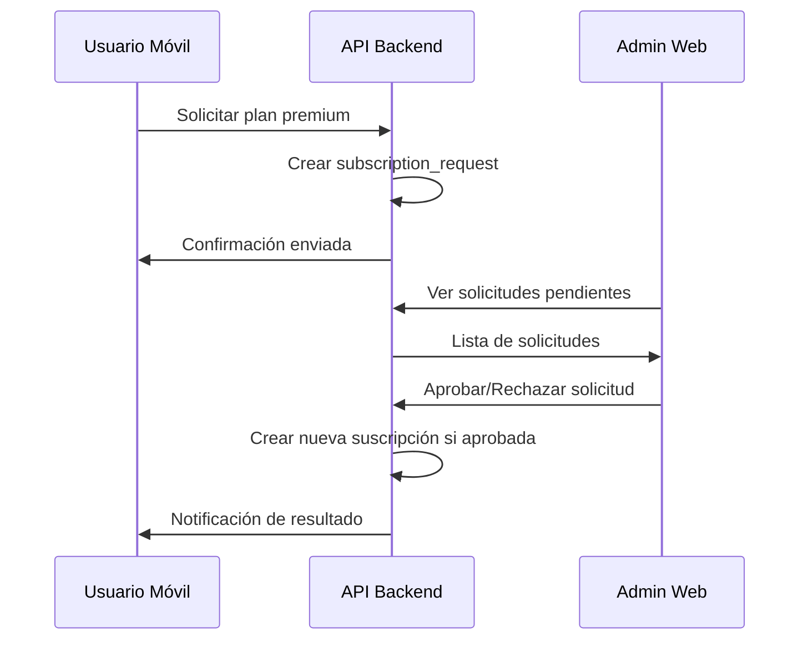
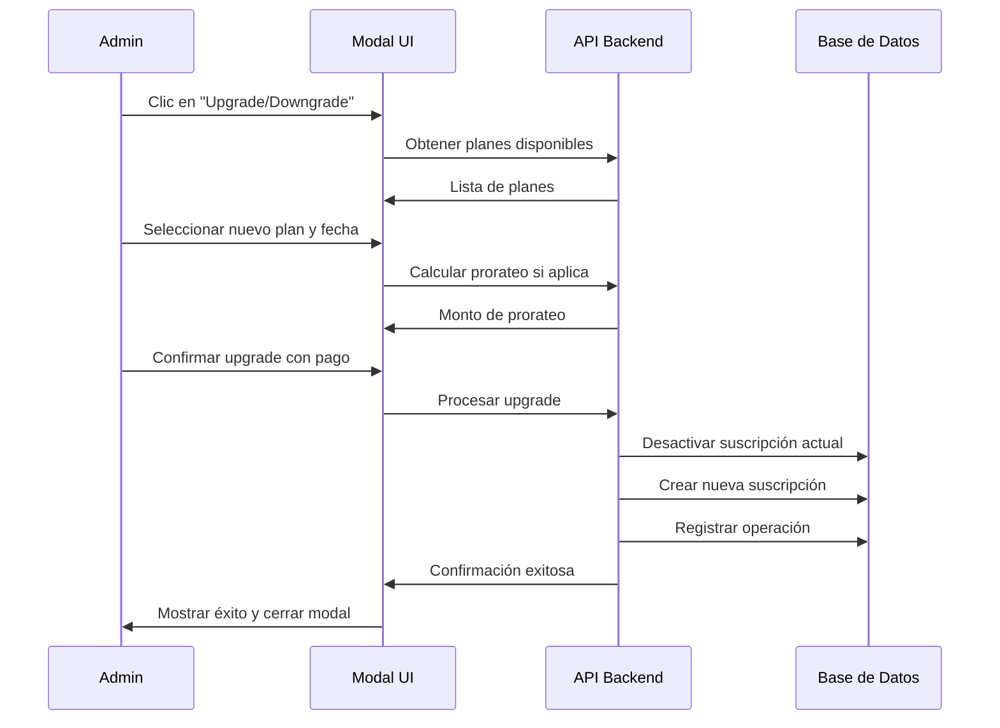
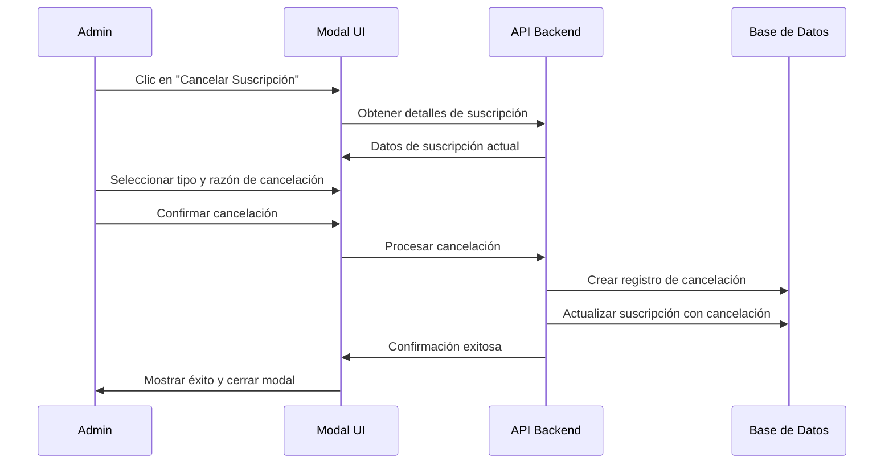

# PRD: Gestión de Suscripciones para GymSpace

## Resumen Ejecutivo

Este documento especifica los requerimientos para implementar un sistema completo de gestión de suscripciones que permita a los administradores de GymSpace gestionar planes, aprobar solicitudes de usuarios, realizar upgrades directos, cancelaciones y renovar suscripciones a través de interfaces modales intuitivas.

> **⚠️ Alcance de Implementación**: Esta funcionalidad **SOLO impacta** al **administrador web** (`packages/web`) y a la **API backend** (`packages/api`). No requiere modificaciones en la aplicación móvil (`packages/mobile`).

## Contexto Actual

### Estado Actual del Sistema
- Los usuarios obtienen automáticamente el plan gratuito al registrarse
- El plan gratuito vence a los 30 días
- Existe infraestructura básica en `packages/api/src/modules/subscriptions`
- Interfaz básica de listado de organizaciones en el admin web

### Arquitectura Existente
```
packages/api/src/modules/subscriptions/
├── dto/
│   ├── upgrade-subscription.dto.ts
│   ├── subscription-status.dto.ts
│   ├── available-plans.dto.ts
│   └── affiliate-organization.dto.ts
├── subscriptions.controller.ts
├── subscriptions.service.ts
└── subscriptions.module.ts
```

## Objetivos del Proyecto

1. **Gestión de Planes**: Permitir a administradores crear, editar y gestionar planes de suscripción
2. **Solicitudes de Usuarios**: Implementar flujo de solicitud de planes desde la app móvil
3. **Aprobación Administrativa**: Sistema de aprobación/rechazo de solicitudes
4. **Gestión Directa de Suscripciones**: Administradores pueden realizar upgrades, downgrades y cancelaciones directamente
5. **Renovación de Planes**: Proceso de renovación con pagos y extensión de fechas
6. **Dashboard Organizacional**: Vista detallada de organizaciones con métricas de gimnasios
7. **Interfaz Modal**: Todas las operaciones de suscripción se manejan mediante modales para mejor UX

## Funcionalidades Requeridas

### 1. Gestión de Planes (Admin Web)

#### 1.1 Listado de Planes
**Ubicación**: `packages/web/src/app/admin/plans/page.tsx`

**Funcionalidades**:
- Mostrar todos los planes disponibles (activos e inactivos)
- Filtros: activo/inactivo, precio, tipo (gratuito/pago)
- Acciones: crear, editar, activar/desactivar, ocultar/mostrar

**Campos a mostrar**:
- Nombre del plan
- Descripción
- Precio (por moneda)
- Frecuencia de facturación
- Límites (gimnasios, clientes, usuarios)
- Estado (activo/inactivo)
- Visibilidad (público/oculto)
- Fecha de creación

#### 1.2 Creación/Edición de Planes (Modales)
**Ubicación**: Componentes modales en `packages/web/src/components/admin/plans/`
- `CreatePlanModal.tsx` - Modal para crear nuevo plan
- `EditPlanModal.tsx` - Modal para editar plan existente

**Campos del formulario**:
```typescript
interface PlanFormData {
  name: string;
  description: string;
  price: Record<string, { value: number; currency: string }>;
  billingFrequency: 'MONTHLY' | 'YEARLY';
  duration: number;
  durationPeriod: 'DAY' | 'MONTH' | 'YEAR';
  maxGyms: number;
  maxClientsPerGym: number;
  maxUsersPerGym: number;
  features: string[];
  isActive: boolean;
  isPublic: boolean; // Para ocultar planes
}
```

**Validaciones**:
- Nombre único
- Precio válido para cada moneda
- Límites positivos
- Al menos una característica

### 2. Listado de Organizaciones Mejorado

#### 2.1 Mejoras al Listado Actual
**Ubicación**: `packages/web/src/app/admin/organizations/page.tsx`

**Información adicional a mostrar**:
- Plan actual de suscripción
- Fecha de vencimiento
- Días restantes
- Estado de la suscripción
- Número de gimnasios
- Uso vs límites

**Acciones disponibles (via modales)**:
- 🔄 **Upgrade/Downgrade** - Cambiar a otro plan disponible
- ❌ **Cancelar suscripción** - Cancelar plan actual
- 🔄 **Renovar** - Extender suscripción actual
- 📊 **Ver detalles** - Información completa de la organización

**Estructura de datos**:
```typescript
interface OrganizationListItem {
  id: string;
  name: string;
  ownerName: string;
  createdAt: Date;
  subscription: {
    planName: string;
    status: 'ACTIVE' | 'EXPIRED' | 'PENDING';
    endDate: Date;
    daysRemaining: number;
    isFreePlan: boolean;
  };
  usage: {
    gyms: number;
    totalClients: number;
    totalUsers: number;
  };
  limits: {
    maxGyms: number;
    maxClientsPerGym: number;
    maxUsersPerGym: number;
  };
}
```

### 3. Detalle de Organización

#### 3.1 Vista Detallada
**Ubicación**: `packages/web/src/app/admin/organizations/[id]/page.tsx`

**Secciones**:
1. **Información General**
   - Datos de la organización
   - Información del propietario
   - Estado de suscripción actual

2. **Lista de Gimnasios**
   - Nombre del gimnasio
   - Número de clientes
   - Número de usuarios/colaboradores
   - Número de planes/membresías
   - Fecha de creación
   - Estado

3. **Métricas y Estadísticas**
   - Uso total vs límites del plan
   - Gráficos de crecimiento
   - Ingresos generados (si aplica)

### 4. Sistema de Solicitudes de Planes

#### 4.1 Solicitud desde App Móvil
**Flujo del usuario**:
1. Usuario ve planes disponibles en la app
2. Selecciona plan deseado
3. Completa información de solicitud
4. Envía solicitud para aprobación administrativa

**Estructura de solicitud**:
```typescript
interface SubscriptionRequest {
  id: string;
  organizationId: string;
  requestedPlanId: string;
  requestedBy: string;
  requestDate: Date;
  status: 'PENDING' | 'APPROVED' | 'REJECTED';
  message?: string; // Mensaje del usuario
  adminResponse?: string; // Respuesta del admin
  processedBy?: string; // ID del admin que procesó
  processedAt?: Date;
}
```

#### 4.2 Gestión de Solicitudes (Admin Web)
**Ubicación**: `packages/web/src/app/admin/subscription-requests/page.tsx`

**Funcionalidades**:
- Lista de solicitudes pendientes y procesadas
- Filtros por estado, fecha, organización
- **Acciones via modales**:
  - ✅ **Aprobar solicitud** - Modal con confirmación y selección de fecha inicio
  - ❌ **Rechazar solicitud** - Modal con campo obligatorio para razón del rechazo
- Notificaciones de nuevas solicitudes

### 5. Gestión Completa de Suscripciones (Modales)

#### 5.1 Upgrade/Downgrade de Planes
**Ubicación**: `packages/web/src/components/admin/subscriptions/UpgradeSubscriptionModal.tsx`

**Funcionalidades**:
- Seleccionar nuevo plan de la lista disponible
- Mostrar comparación actual vs nuevo plan
- Configurar fecha de inicio (inmediato o al vencer actual)
- Calcular prorateo si es upgrade inmediato
- Especificar monto del pago
- Confirmar cambio con justificación

#### 5.2 Cancelación de Suscripciones
**Ubicación**: `packages/web/src/components/admin/subscriptions/CancelSubscriptionModal.tsx`

**Funcionalidades**:
- Mostrar detalles de la suscripción actual
- Seleccionar tipo de cancelación:
  - **Inmediata**: Cancela acceso al momento
  - **Al vencimiento**: Cancela al finalizar periodo actual
- Campo obligatorio para razón de cancelación
- Confirmación con advertencias sobre pérdida de acceso

#### 5.3 Renovación de Planes
**Ubicación**: `packages/web/src/components/admin/subscriptions/RenewSubscriptionModal.tsx`

**Funcionalidades**:
- Extender suscripción actual con el mismo plan
- Opción de cambiar plan durante renovación
- Configurar duración personalizada
- Especificar monto del pago y método
- Fecha de inicio configurable (por defecto: al vencer actual)

**Estructuras de datos para modales**:
```typescript
interface UpgradeSubscriptionData {
  organizationId: string;
  newPlanId: string;
  startDate: Date; // inmediato o al vencer
  paymentAmount: Record<string, { value: number; currency: string }>;
  paymentMethod: string;
  upgradeReason: string;
  applyProration: boolean; // para upgrades inmediatos
}

interface CancelSubscriptionData {
  organizationId: string;
  subscriptionId: string;
  cancelationType: 'IMMEDIATE' | 'END_OF_PERIOD';
  cancellationReason: string;
  effectiveDate: Date;
}

interface RenewalData {
  organizationId: string;
  subscriptionId: string;
  newPlanId?: string; // opcional si cambia plan durante renovación
  duration: number;
  durationPeriod: 'DAY' | 'MONTH' | 'YEAR';
  paymentAmount: Record<string, { value: number; currency: string }>;
  paymentMethod: string;
  startDate: Date;
  notes?: string;
}
```

## Endpoints de API Requeridos

### 1. Gestión de Planes
```typescript
// Obtener todos los planes (incluye ocultos para admin)
GET /api/admin/subscription-plans
// Crear nuevo plan
POST /api/admin/subscription-plans
// Obtener plan específico
GET /api/admin/subscription-plans/:id
// Actualizar plan
PUT /api/admin/subscription-plans/:id
// Eliminar/desactivar plan
DELETE /api/admin/subscription-plans/:id
```

### 2. Solicitudes de Suscripción
```typescript
// Crear solicitud desde móvil
POST /api/subscription-requests
// Listar solicitudes (admin)
GET /api/admin/subscription-requests
// Procesar solicitud (aprobar/rechazar)
PUT /api/admin/subscription-requests/:id/process
```

### 3. Gestión Completa de Suscripciones
```typescript
// Upgrade/Downgrade de suscripción
PUT /api/admin/organizations/:id/upgrade-subscription
// Cancelar suscripción
POST /api/admin/organizations/:id/cancel-subscription
// Renovar suscripción
POST /api/admin/organizations/:id/renew-subscription
// Obtener historial de suscripciones
GET /api/admin/organizations/:id/subscription-history
// Calcular prorateo para upgrades
GET /api/admin/organizations/:id/calculate-proration?newPlanId=:planId&startDate=:date
```

### 4. Organizaciones Mejoradas
```typescript
// Listar organizaciones con detalles de suscripción
GET /api/admin/organizations?include=subscription,usage
// Obtener detalle de organización con gimnasios
GET /api/admin/organizations/:id?include=gyms,stats
```

## Estructura de Base de Datos

### Nuevas Tablas Requeridas

#### 1. subscription_requests
```sql
CREATE TABLE subscription_requests (
  id VARCHAR(36) PRIMARY KEY,
  organization_id VARCHAR(36) NOT NULL,
  requested_plan_id VARCHAR(36) NOT NULL,
  requested_by VARCHAR(36) NOT NULL,
  status ENUM('PENDING', 'APPROVED', 'REJECTED') DEFAULT 'PENDING',
  message TEXT,
  admin_response TEXT,
  processed_by VARCHAR(36),
  processed_at TIMESTAMP NULL,
  created_at TIMESTAMP DEFAULT CURRENT_TIMESTAMP,
  updated_at TIMESTAMP DEFAULT CURRENT_TIMESTAMP ON UPDATE CURRENT_TIMESTAMP,
  FOREIGN KEY (organization_id) REFERENCES organizations(id),
  FOREIGN KEY (requested_plan_id) REFERENCES subscription_plans(id),
  FOREIGN KEY (requested_by) REFERENCES users(id),
  FOREIGN KEY (processed_by) REFERENCES users(id)
);
```

#### 2. subscription_operations
```sql
CREATE TABLE subscription_operations (
  id VARCHAR(36) PRIMARY KEY,
  organization_id VARCHAR(36) NOT NULL,
  previous_subscription_id VARCHAR(36),
  new_subscription_id VARCHAR(36),
  operation_type ENUM('UPGRADE', 'DOWNGRADE', 'RENEWAL', 'CANCELLATION') NOT NULL,
  payment_amount JSON, -- {currency: {value, currency}}
  payment_method VARCHAR(100),
  operation_reason TEXT,
  proration_amount JSON, -- Para upgrades/downgrades
  effective_date TIMESTAMP NOT NULL,
  processed_by VARCHAR(36) NOT NULL,
  created_at TIMESTAMP DEFAULT CURRENT_TIMESTAMP,
  FOREIGN KEY (organization_id) REFERENCES organizations(id),
  FOREIGN KEY (previous_subscription_id) REFERENCES subscription_organizations(id),
  FOREIGN KEY (new_subscription_id) REFERENCES subscription_organizations(id),
  FOREIGN KEY (processed_by) REFERENCES users(id)
);
```

#### 3. subscription_cancellations
```sql
CREATE TABLE subscription_cancellations (
  id VARCHAR(36) PRIMARY KEY,
  organization_id VARCHAR(36) NOT NULL,
  subscription_id VARCHAR(36) NOT NULL,
  cancellation_type ENUM('IMMEDIATE', 'END_OF_PERIOD') NOT NULL,
  cancellation_reason TEXT NOT NULL,
  requested_date TIMESTAMP DEFAULT CURRENT_TIMESTAMP,
  effective_date TIMESTAMP NOT NULL,
  processed_by VARCHAR(36) NOT NULL,
  status ENUM('PENDING', 'COMPLETED', 'REVERTED') DEFAULT 'PENDING',
  FOREIGN KEY (organization_id) REFERENCES organizations(id),
  FOREIGN KEY (subscription_id) REFERENCES subscription_organizations(id),
  FOREIGN KEY (processed_by) REFERENCES users(id)
);
```

### Modificaciones a Tablas Existentes

#### subscription_plans
```sql
ALTER TABLE subscription_plans
ADD COLUMN is_public BOOLEAN DEFAULT true,
ADD COLUMN sort_order INT DEFAULT 0;
```

#### subscription_organizations
```sql
ALTER TABLE subscription_organizations
ADD COLUMN cancellation_id VARCHAR(36) NULL,
ADD FOREIGN KEY (cancellation_id) REFERENCES subscription_cancellations(id);
```

## Flujos de Trabajo

### 1. Flujo de Solicitud de Plan


### 2. Flujo de Upgrade/Downgrade (Modal)


### 3. Flujo de Cancelación (Modal)


## Consideraciones Técnicas

### 1. Seguridad
- Validación de permisos de administrador para todas las operaciones
- Verificación de ownership de organizaciones
- Logs de auditoría para cambios de suscripciones

### 2. Performance
- Indices en tablas de solicitudes y renovaciones
- Caché de planes activos
- Paginación en listados

### 3. Notificaciones
- Email al usuario cuando se aprueba/rechaza solicitud
- Notificaciones push en app móvil
- Alertas de vencimiento próximo

## Entregables

### Fase 1: Gestión de Planes (Sprint 1-2)
- [ ] CRUD de planes en admin web con modales
- [ ] API endpoints para gestión de planes con prefijo `/admin`
- [ ] Validaciones y permisos de administrador

### Fase 2: Listado de Organizaciones Mejorado (Sprint 2-3)
- [ ] Migrar `/organizations` a `/admin/organizations`
- [ ] Agregar información de suscripciones al listado
- [ ] Implementar botones de acción con modales
- [ ] Sistema de filtros y búsqueda

### Fase 3: Modales de Gestión de Suscripciones (Sprint 3-4)
- [ ] Modal de Upgrade/Downgrade con cálculo de prorateo
- [ ] Modal de Cancelación con tipos y razones
- [ ] Modal de Renovación con opciones personalizadas
- [ ] Validaciones y confirmaciones en cada modal

### Fase 4: Solicitudes y Procesamiento (Sprint 4-5)
- [ ] Sistema de solicitudes desde móvil (sin cambios en este PRD)
- [ ] Interface de gestión de solicitudes en admin con modales
- [ ] Notificaciones de estado y procesamiento

### Fase 5: Vista Detallada y Reportes (Sprint 5-6)
- [ ] Vista detallada de organizaciones con gimnasios
- [ ] Historial completo de operaciones de suscripción
- [ ] Métricas y estadísticas avanzadas
- [ ] Reportes de pagos y cancelaciones

## Métricas de Éxito

1. **Funcionales**
   - 100% de solicitudes procesadas dentro de 24 horas
   - 95% de renovaciones exitosas
   - 0 errores en cálculos de fechas

2. **Técnicas**
   - Tiempo de respuesta < 200ms para listados
   - 99.9% uptime del sistema
   - Cobertura de pruebas > 80%

3. **Negocio**
   - Incremento en conversiones a planes premium
   - Reducción en tiempo de gestión administrativa
   - Satisfacción del usuario > 4.5/5

## Riesgos y Mitigaciones

| Riesgo | Probabilidad | Impacto | Mitigación |
|--------|-------------|---------|------------|
| Errores en cálculo de fechas | Media | Alto | Pruebas exhaustivas, validación múltiple |
| Problemas de concurrencia | Baja | Alto | Transacciones atómicas, locks optimistas |
| Migración de datos | Alta | Medio | Scripts de migración, rollback plan |

## Estructura de Rutas Admin

### Rutas Web con Prefijo `/admin`
```
packages/web/src/app/admin/
├── layout.tsx                           # Layout del admin con autenticación
├── page.tsx                            # Dashboard principal del admin
├── organizations/
│   ├── page.tsx                        # Listado de organizaciones
│   └── [id]/
│       └── page.tsx                    # Detalle de organización
├── plans/
│   └── page.tsx                        # Gestión de planes
└── subscription-requests/
    └── page.tsx                        # Gestión de solicitudes
```

### Componentes Modales
```
packages/web/src/components/admin/
├── plans/
│   ├── CreatePlanModal.tsx
│   └── EditPlanModal.tsx
├── subscriptions/
│   ├── UpgradeSubscriptionModal.tsx
│   ├── CancelSubscriptionModal.tsx
│   └── RenewSubscriptionModal.tsx
└── requests/
    ├── ApproveRequestModal.tsx
    └── RejectRequestModal.tsx
```

## Consideraciones de Implementación

### Solo Impacta Admin y API
- ✅ **packages/web**: Nuevas rutas `/admin/*` y modales
- ✅ **packages/api**: Nuevos endpoints `/api/admin/*`
- ❌ **packages/mobile**: Sin cambios en esta fase

### Seguridad y Permisos
- Todos los endpoints `/api/admin/*` requieren rol de administrador
- Validación de permisos en cada operación de suscripción
- Logs de auditoría para todas las operaciones administrativas

### UX/UI con Modales
- Todas las operaciones críticas se confirman via modales
- Carga progresiva de datos para mejor performance
- Validaciones en tiempo real en formularios
- Feedback visual inmediato de acciones

## Delegación de Agentes Especializados

Para la correcta implementación de este PRD, se debe delegar las tareas específicas a los siguientes agentes especializados:

### Frontend Web Expert (.claude/agents/frontend-web-expert.md)
**Responsabilidades**:
- Implementación completa de todas las interfaces de administración en `packages/web/src/app/admin/`
- Desarrollo de todos los componentes modales en `packages/web/src/components/admin/`
- Creación de formularios con react-hook-form y validaciones con zod
- Implementación de controladores TanStack Query para manejo de estado del servidor
- Integración con shadcn/ui siguiendo los patrones establecidos del proyecto

**Tareas específicas**:
- `/admin/plans/page.tsx` - Gestión de planes de suscripción
- `/admin/organizations/page.tsx` - Listado mejorado de organizaciones
- `/admin/organizations/[id]/page.tsx` - Vista detallada de organización
- `/admin/subscription-requests/page.tsx` - Gestión de solicitudes
- Modales: `CreatePlanModal`, `EditPlanModal`, `UpgradeSubscriptionModal`, `CancelSubscriptionModal`, `RenewSubscriptionModal`
- Controladores TanStack Query para cada funcionalidad

### Gymspace API SDK Developer (.claude/agents/gymspace-api-sdk-developer.md)
**Responsabilidades**:
- Desarrollo de todos los endpoints de API requeridos con prefijo `/admin`
- Actualización y sincronización del TypeScript SDK en `packages/sdk/src/resources`
- Validación de consistencia API-SDK mediante diagnósticos IDE
- Análisis e implementación de estrategias de caché
- Documentación Swagger completa y actualizada

**Tareas específicas**:
- Endpoints de gestión de planes: `GET/POST/PUT/DELETE /api/admin/subscription-plans`
- Endpoints de solicitudes: `GET/PUT /api/admin/subscription-requests`
- Endpoints de gestión de suscripciones: `/api/admin/organizations/:id/upgrade-subscription`, `/cancel-subscription`, `/renew-subscription`
- Actualización de recursos SDK para sincronización completa
- Implementación de DTOs y validaciones para todas las operaciones

### Coordinación entre Agentes

**Flujo de trabajo recomendado**:
1. **Gymspace API SDK Developer** inicia desarrollando los endpoints y DTOs base
2. **Frontend Web Expert** implementa las interfaces consumiendo los endpoints via SDK
3. Iteración coordinada para ajustes de tipos y validaciones
4. Validación cruzada mediante IDE diagnostics para garantizar sincronización completa

**Consideraciones de integración**:
- Ambos agentes deben seguir los patrones establecidos en el proyecto
- El SDK debe mantener sincronización perfecta con los endpoints de API
- Las interfaces web deben usar exclusivamente tipos del SDK, nunca duplicar definiciones
- Implementar caching inteligente basado en patrones de acceso a datos

## Conclusión

Esta implementación proporcionará un sistema completo de gestión de suscripciones que mejorará significativamente la experiencia de los administradores, permitiendo un control total sobre las suscripciones de las organizaciones a través de interfaces modales intuitivas y eficientes, sin impactar la aplicación móvil existente.

La delegación adecuada a los agentes especializados garantizará una implementación eficiente, manteniendo la consistencia arquitectural del proyecto y optimizando la coordinación entre frontend y backend.