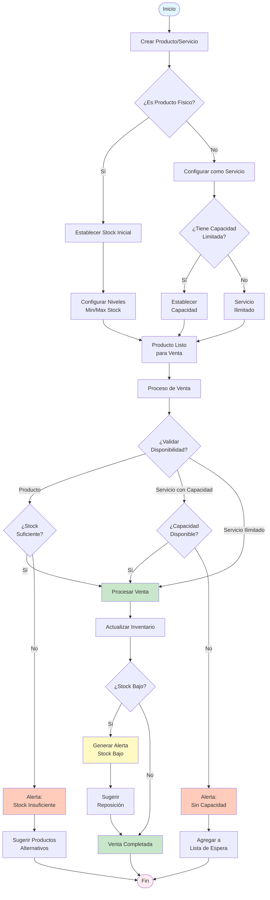

# Sistema de Gestión de Inventario - GymSpace

## Resumen Ejecutivo

El sistema de inventario de GymSpace es una solución integral que permite a los gimnasios gestionar tanto productos físicos como servicios. Diseñado para ser flexible y fácil de usar, el sistema automatiza el control de stock, facilita las ventas y proporciona visibilidad completa sobre el inventario del gimnasio.

## Componentes Principales

### 1. Categorías de Productos
Las categorías permiten organizar productos y servicios de manera lógica para facilitar su gestión y búsqueda.

**Características:**
- Organización jerárquica de productos y servicios
- Identificación visual mediante colores personalizados
- Control de integridad (no se pueden eliminar categorías con productos asociados)
- Contador automático de productos por categoría

### 2. Productos Físicos
Artículos tangibles que el gimnasio vende y que requieren control de inventario.

**Características:**
- **Control de Stock:** Seguimiento automático de cantidades disponibles
- **Niveles de Inventario:** 
  - Stock mínimo: Alerta cuando el inventario está bajo
  - Stock máximo: Control de sobre-inventario
  - Stock actual: Cantidad disponible en tiempo real
- **Estados del Producto:**
  - Activo: Disponible para venta
  - Inactivo: No disponible temporalmente
- **Imágenes:** Asociación de imágenes para identificación visual

**Ejemplos típicos:**
- Suplementos nutricionales
- Ropa deportiva
- Accesorios de entrenamiento
- Bebidas energéticas
- Toallas

### 3. Servicios
Prestaciones intangibles que ofrece el gimnasio sin necesidad de control de inventario.

**Características:**
- **Sin Control de Stock:** Los servicios no tienen inventario físico
- **Flexibilidad de Precio:** Precios configurables por sesión o paquete
- **Categorización:** Organización por tipo de servicio
- **Capacidad Opcional:** Algunos servicios pueden tener límite de capacidad (ej: clases grupales)

**Ejemplos típicos:**
- Entrenamiento personalizado
- Clases grupales
- Evaluaciones físicas
- Asesoría nutricional
- Masajes deportivos

## Tipos de Control de Inventario

El sistema ofrece diferentes niveles de control según las necesidades:

### 1. Sin Control (`none`)
- Para servicios y productos que no requieren seguimiento de stock
- No se valida disponibilidad en ventas
- Ideal para servicios ilimitados

### 2. Control Simple (`simple`)
- Seguimiento básico de cantidades
- Validación de stock antes de venta
- Actualización automática al vender
- Alertas de stock bajo

### 3. Control Avanzado (`advanced`)
- Todo lo del control simple más:
- Historial detallado de movimientos
- Proyecciones de agotamiento
- Análisis de rotación
- Sugerencias de reorden

### 4. Control por Capacidad (`capacity`)
- Para servicios con límite de participantes
- Control de disponibilidad por sesión
- Lista de espera automática
- Gestión de cancelaciones

## Proceso de Venta

### Flujo de Venta Estándar

1. **Selección de Productos/Servicios**
   - Búsqueda por nombre, categoría o código
   - Verificación de disponibilidad en tiempo real
   - Visualización de precios actualizados

2. **Validación de Inventario**
   - Verificación automática de stock disponible
   - Alertas de stock insuficiente
   - Sugerencias de productos alternativos

3. **Procesamiento de Venta**
   - Generación de número único de venta (formato: YYYYMMDD####)
   - Cálculo automático de totales
   - Registro de cliente (opcional)

4. **Actualización de Inventario**
   - Descuento automático del stock
   - Actualización en tiempo real
   - Generación de alertas si se alcanza stock mínimo

5. **Registro de Pago**
   - Estado de pago (pagado/pendiente)
   - Opciones de pago múltiples
   - Emisión de comprobante

## Gestión de Stock

### Monitoreo de Inventario

**Panel de Control:**
- Vista general del inventario total
- Productos con stock bajo (alertas visuales)
- Productos más vendidos
- Valor total del inventario

**Alertas Automáticas:**
- Stock bajo: Cuando un producto alcanza el nivel mínimo configurado
- Stock agotado: Notificación inmediata cuando se agota un producto
- Productos próximos a vencer (si aplica)

### Reposición de Stock

**Proceso Manual:**
1. Identificación de productos con stock bajo
2. Generación de orden de compra
3. Recepción de mercancía
4. Actualización manual del stock
5. Registro de proveedor y costos

**Sugerencias Inteligentes:**
- Cálculo de punto de reorden basado en histórico de ventas
- Proyección de agotamiento
- Sugerencias de cantidad óptima de pedido

## Diagrama de Flujo de Stock

## Reportes y Análisis

### Reportes Disponibles

**Inventario Actual:**
- Lista completa de productos con stock actual
- Valorización del inventario
- Productos por categoría
- Estado de productos (activos/inactivos)

**Movimientos de Stock:**
- Historial de entradas y salidas
- Ventas por período
- Ajustes de inventario
- Devoluciones y cancelaciones

**Análisis de Ventas:**
- Productos más vendidos
- Servicios más solicitados
- Tendencias por temporada
- Rentabilidad por producto/servicio

**Alertas y Excepciones:**
- Productos con stock bajo
- Productos sin movimiento
- Productos próximos a vencer
- Discrepancias de inventario

### Indicadores Clave (KPIs)

- **Rotación de Inventario:** Frecuencia de renovación del stock
- **Días de Inventario:** Tiempo promedio de permanencia en stock
- **Margen de Ganancia:** Rentabilidad por producto/servicio
- **Tasa de Agotamiento:** Frecuencia de stock-outs
- **Precisión de Inventario:** Concordancia entre sistema y físico

## Beneficios del Sistema

### Para la Administración
- **Control Total:** Visibilidad completa del inventario en tiempo real
- **Automatización:** Reducción de tareas manuales y errores
- **Toma de Decisiones:** Datos precisos para decisiones informadas
- **Optimización:** Reducción de pérdidas por stock obsoleto o faltante

### Para el Personal
- **Facilidad de Uso:** Interface intuitiva y procesos simples
- **Eficiencia:** Ventas más rápidas y precisas
- **Alertas Proactivas:** Notificaciones automáticas de situaciones importantes
- **Menos Errores:** Validaciones automáticas reducen equivocaciones

### Para los Clientes
- **Disponibilidad:** Información precisa sobre productos disponibles
- **Variedad:** Mejor surtido gracias a la gestión eficiente
- **Rapidez:** Proceso de compra ágil y sin demoras
- **Confiabilidad:** Seguridad de que los productos están disponibles

## Integración con Otros Módulos

El sistema de inventario se integra perfectamente con:

- **Módulo de Ventas:** Procesamiento automático y actualización de stock
- **Módulo de Proveedores:** Gestión de compras y reposición
- **Módulo de Reportes:** Análisis detallados y dashboards
- **Módulo de Contabilidad:** Valorización y costos
- **Módulo de Clientes:** Historial de compras y preferencias

## Feature: Aumento de Stock de Productos

### Descripción
Cuando un usuario visualiza un producto con control de stock habilitado, debe poder aumentar el inventario de manera rápida y documentada. Esta funcionalidad permite registrar entradas de inventario con trazabilidad completa.

### Funcionalidad

**Trigger:**
- El usuario accede a la vista de detalle de un producto con stock habilitado
- Aparece un botón/icono para "Aumentar Stock" o "+" prominente

**Modal de Aumento de Stock:**
Al hacer clic en aumentar stock, se despliega un modal con los siguientes campos:

1. **Cantidad a Agregar** (Requerido)
   - Campo numérico para ingresar la cantidad de unidades a agregar
   - Validación de números positivos

2. **Notas** (Opcional)
   - Campo de texto para agregar observaciones sobre la entrada
   - Ej: "Reposición mensual", "Compra especial", etc.

3. **Proveedor** (Opcional)
   - Selector de proveedor existente o creación rápida
   - Creación simple solo con nombre del proveedor
   - Se guarda la relación para futuras referencias

4. **Adjunto/Comprobante** (Opcional)
   - Opción para adjuntar archivo (imagen/PDF)
   - Para guardar facturas, recibos o comprobantes de compra
   - Tamaño máximo del archivo: 5MB

### Registro de Proveedor Simplificado

**Creación Rápida:**
- Solo se requiere el nombre del proveedor
- Campos opcionales: teléfono, email, dirección
- Se puede completar la información posteriormente
- Integración con el módulo de proveedores existente

### Flujo de Usuario

```mermaid
graph TB
    Start([Usuario en Vista<br/>de Producto]) --> CheckStock{¿Producto con<br/>Stock Habilitado?}
    
    CheckStock -->|Sí| ShowButton[Mostrar Botón<br/>Aumentar Stock]
    CheckStock -->|No| NoAction[Sin Acción<br/>de Stock]
    
    ShowButton --> ClickButton[Usuario Hace Clic<br/>en Aumentar Stock]
    ClickButton --> OpenModal[Abrir Modal de<br/>Aumento de Stock]
    
    OpenModal --> FillQuantity[Ingresar Cantidad<br/>a Agregar]
    
    FillQuantity --> OptionalFields[Campos Opcionales]
    
    OptionalFields --> AddNotes{¿Agregar<br/>Notas?}
    AddNotes -->|Sí| InputNotes[Escribir Notas]
    AddNotes -->|No| SkipNotes[Continuar]
    
    InputNotes --> AddSupplier
    SkipNotes --> AddSupplier{¿Asociar<br/>Proveedor?}
    
    AddSupplier -->|Sí| SupplierChoice{¿Proveedor<br/>Existe?}
    AddSupplier -->|No| SkipSupplier[Continuar]
    
    SupplierChoice -->|Sí| SelectSupplier[Seleccionar<br/>de Lista]
    SupplierChoice -->|No| QuickCreate[Crear Rápido<br/>Solo Nombre]
    
    SelectSupplier --> AddAttachment
    QuickCreate --> SaveSupplier[Guardar Nuevo<br/>Proveedor]
    SaveSupplier --> AddAttachment
    SkipSupplier --> AddAttachment{¿Adjuntar<br/>Comprobante?}
    
    AddAttachment -->|Sí| UploadFile[Subir Archivo<br/>Imagen/PDF]
    AddAttachment -->|No| SkipAttachment[Continuar]
    
    UploadFile --> ValidateFile{¿Archivo<br/>Válido?}
    ValidateFile -->|No| FileError[Error:<br/>Archivo Inválido]
    ValidateFile -->|Sí| ReadyToSave
    
    FileError --> UploadFile
    SkipAttachment --> ReadyToSave[Listo para<br/>Guardar]
    
    ReadyToSave --> SaveStock[Guardar Aumento<br/>de Stock]
    
    SaveStock --> UpdateInventory[Actualizar<br/>Inventario]
    UpdateInventory --> CreateLog[Crear Registro<br/>de Movimiento]
    CreateLog --> ShowSuccess[Mostrar Mensaje<br/>de Éxito]
    
    ShowSuccess --> CloseModal[Cerrar Modal]
    CloseModal --> RefreshView[Actualizar Vista<br/>con Nuevo Stock]
    
    RefreshView --> End([Fin])
    NoAction --> End
    
    style Start fill:#e1f5fe
    style End fill:#ffebee
    style SaveStock fill:#c8e6c9
    style ShowSuccess fill:#c8e6c9
    style FileError fill:#ffccbc
    style OpenModal fill:#fff9c4
```

### Registro de Movimiento

Cada aumento de stock genera un registro con:
- **Fecha y hora** de la operación
- **Usuario** que realizó el aumento
- **Cantidad** agregada
- **Stock anterior** y **stock nuevo**
- **Proveedor** asociado (si aplica)
- **Notas** agregadas
- **Referencia al comprobante** adjunto
- **Tipo de movimiento**: "ENTRADA_MANUAL"

### Validaciones

- La cantidad debe ser un número entero positivo
- El archivo adjunto no debe exceder 5MB
- Formatos permitidos: JPG, PNG, PDF
- El nombre del proveedor es obligatorio si se selecciona crear nuevo

### Beneficios

- **Trazabilidad completa** de entradas de inventario
- **Registro de proveedores** para análisis de compras
- **Documentación** mediante comprobantes adjuntos
- **Rapidez** en el proceso de actualización de stock
- **Flexibilidad** con campos opcionales

## Conclusión

El sistema de gestión de inventario de GymSpace proporciona una solución completa y flexible que se adapta a las necesidades específicas de cada gimnasio. Desde el control básico de productos hasta la gestión avanzada de servicios con capacidad limitada, el sistema automatiza procesos críticos, reduce errores y proporciona la información necesaria para una gestión eficiente del negocio.

La combinación de controles automatizados, alertas inteligentes y reportes detallados permite a los gimnasios mantener un inventario óptimo, mejorar la satisfacción del cliente y maximizar la rentabilidad de sus operaciones de venta.