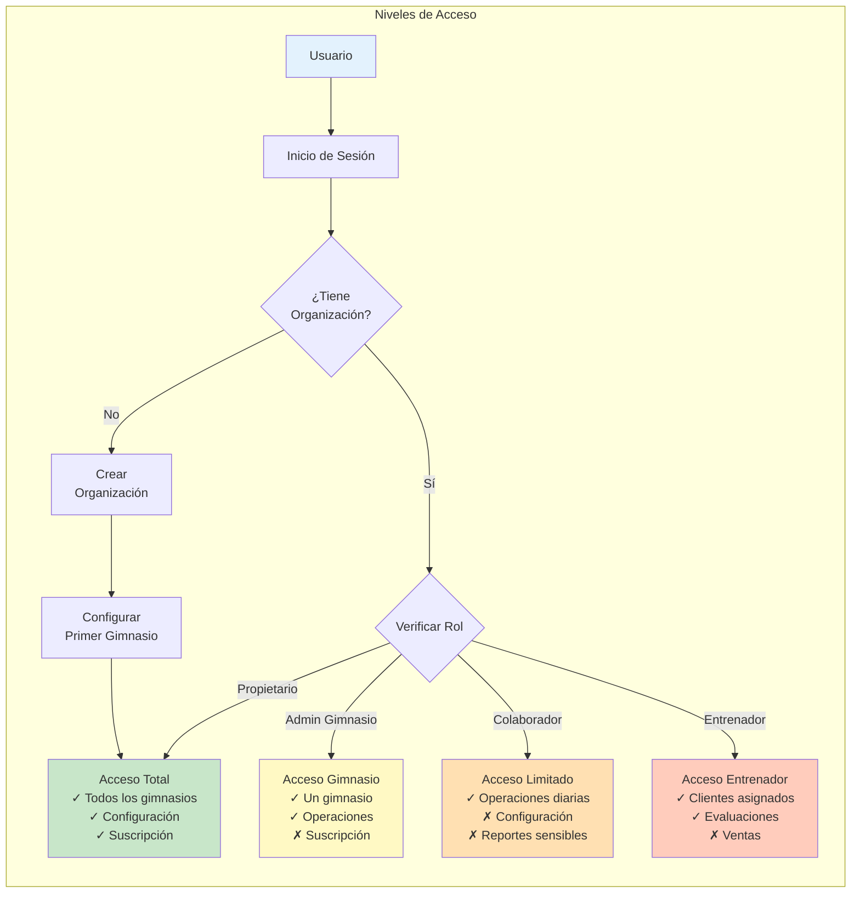

# Arquitectura Multi-Tenant

## Descripción General

GymSpace utiliza una arquitectura multi-tenant que permite a múltiples organizaciones operar de forma independiente y segura dentro de la misma plataforma. Cada organización puede gestionar uno o varios gimnasios, con usuarios y datos completamente aislados.

## Estructura Organizacional

### 1. Organizaciones

La **Organización** es la entidad principal que agrupa uno o más gimnasios bajo una misma administración.

**Características:**
- Datos completamente aislados de otras organizaciones
- Configuración centralizada de la suscripción
- Gestión unificada de usuarios y permisos
- Facturación consolidada para todos los gimnasios
- Panel administrativo central

**Casos de Uso:**
- Dueño individual con un gimnasio
- Cadena de gimnasios con múltiples sucursales
- Franquicias con gestión centralizada

### 2. Gimnasios

Cada **Gimnasio** representa una ubicación física o sucursal dentro de una organización.

**Características:**
- Configuración independiente (horarios, servicios, precios)
- Inventario y ventas propios
- Personal asignado específicamente
- Clientes y contratos locales
- Reportes individuales y consolidados

**Gestión:**
- Cada gimnasio mantiene su operación diaria independiente
- Los datos pueden compartirse entre gimnasios de la misma organización
- Transferencia de clientes entre sucursales
- Reportes comparativos entre gimnasios

### 3. Usuarios y Roles

Los **Usuarios** son las personas que acceden al sistema con diferentes niveles de permisos.

**Tipos de Usuarios:**

**Propietario (Owner)**
- Acceso completo a la organización
- Gestión de suscripción y facturación
- Creación y eliminación de gimnasios
- Administración de todos los usuarios
- Acceso a reportes consolidados

**Administrador de Gimnasio**
- Gestión completa de un gimnasio específico
- Administración de personal del gimnasio
- Configuración de servicios y precios
- Acceso a reportes del gimnasio

**Colaborador**
- Acceso operativo según permisos asignados
- Ventas y atención a clientes
- Gestión de inventario (si autorizado)
- Registro de check-ins

**Entrenador**
- Gestión de clientes asignados
- Registro de evaluaciones
- Visualización de horarios y clases
- Acceso limitado a reportes

## Diagrama de Estructura

```mermaid
graph TB
    subgraph "Plataforma GymSpace"
        Platform[GymSpace Platform]
    end
    
    subgraph "Organización A"
        OrgA[Organización A<br/>Plan Premium]
        
        subgraph "Gimnasios Org A"
            GymA1[Gimnasio Centro<br/>50 empleados]
            GymA2[Gimnasio Norte<br/>30 empleados]
            GymA3[Gimnasio Sur<br/>25 empleados]
        end
        
        subgraph "Usuarios Org A"
            OwnerA[👤 Propietario<br/>Juan Pérez]
            AdminA1[👥 Admin Centro]
            AdminA2[👥 Admin Norte]
            CollabA[👥 Colaboradores<br/>15 usuarios]
            TrainerA[👥 Entrenadores<br/>8 usuarios]
        end
    end
    
    subgraph "Organización B"
        OrgB[Organización B<br/>Plan Básico]
        
        subgraph "Gimnasio Org B"
            GymB1[Gimnasio Único<br/>10 empleados]
        end
        
        subgraph "Usuarios Org B"
            OwnerB[👤 Propietario<br/>María García]
            AdminB1[👥 Admin]
            CollabB[👥 Colaboradores<br/>3 usuarios]
        end
    end
    
    subgraph "Organización C"
        OrgC[Organización C<br/>Plan Enterprise]
        
        subgraph "Gimnasios Org C"
            GymC1[Sede Principal]
            GymC2[Sucursal 1]
            GymC3[Sucursal 2]
            GymC4[Sucursal 3]
            GymC5[Sucursal 4]
        end
        
        subgraph "Usuarios Org C"
            OwnerC[👤 Propietario<br/>Corporativo]
            AdminC[👥 Admins<br/>5 usuarios]
            CollabC[👥 Colaboradores<br/>50 usuarios]
            TrainerC[👥 Entrenadores<br/>25 usuarios]
        end
    end
    
    Platform --> OrgA
    Platform --> OrgB
    Platform --> OrgC
    
    OrgA --> GymA1
    OrgA --> GymA2
    OrgA --> GymA3
    
    OrgB --> GymB1
    
    OrgC --> GymC1
    OrgC --> GymC2
    OrgC --> GymC3
    OrgC --> GymC4
    OrgC --> GymC5
    
    OwnerA --> GymA1
    OwnerA --> GymA2
    OwnerA --> GymA3
    
    AdminA1 --> GymA1
    AdminA2 --> GymA2
    
    OwnerB --> GymB1
    AdminB1 --> GymB1
    
    OwnerC --> GymC1
    OwnerC --> GymC2
    OwnerC --> GymC3
    OwnerC --> GymC4
    OwnerC --> GymC5
    
    style Platform fill:#e1f5fe
    style OrgA fill:#c8e6c9
    style OrgB fill:#fff9c4
    style OrgC fill:#ffccbc
    style OwnerA fill:#4caf50
    style OwnerB fill:#4caf50
    style OwnerC fill:#4caf50
```

## Flujo de Acceso y Permisos

## Gestión de Datos

### Aislamiento de Datos

**Nivel Organización:**
- Cada organización tiene sus datos completamente aislados
- No hay visibilidad cruzada entre organizaciones
- Backup y recuperación independiente
- Configuración de seguridad propia

**Nivel Gimnasio:**
- Datos operativos independientes por gimnasio
- Posibilidad de compartir información dentro de la organización
- Reportes individuales y consolidados
- Transferencias autorizadas entre gimnasios

### Seguridad y Privacidad

**Medidas de Seguridad:**
- Autenticación multi-factor opcional
- Tokens de sesión únicos por usuario
- Encriptación de datos sensibles
- Auditoría de accesos y cambios
- Respaldo automático diario

**Control de Acceso:**
- Permisos granulares por rol
- Restricción por gimnasio
- Limitación de horarios de acceso
- Bloqueo por intentos fallidos

## Planes y Límites

### Plan Básico
- 1 gimnasio
- Hasta 10 usuarios
- Funcionalidades esenciales
- Soporte por email

### Plan Premium
- Hasta 5 gimnasios
- Hasta 50 usuarios
- Todas las funcionalidades
- Soporte prioritario
- Reportes avanzados

### Plan Enterprise
- Gimnasios ilimitados
- Usuarios ilimitados
- Personalización avanzada
- Soporte dedicado
- API access
- Integración con sistemas externos

## Casos de Uso Típicos

### Gimnasio Individual
- 1 organización, 1 gimnasio
- Propietario gestiona todo
- 3-5 colaboradores para operación diaria
- Ideal para gimnasios pequeños y medianos

### Cadena Regional
- 1 organización, 3-5 gimnasios
- Administrador por sucursal
- Reportes consolidados para el propietario
- Transferencia de clientes entre sucursales

### Franquicia Nacional
- 1 organización, 10+ gimnasios
- Estructura jerárquica de administración
- Gestión centralizada de marca y estándares
- Reportes comparativos y benchmarking

## Beneficios del Sistema Multi-Tenant

### Para Propietarios
- Gestión centralizada de múltiples ubicaciones
- Visión consolidada del negocio
- Economía de escala en la suscripción
- Estandarización de procesos

### Para Administradores
- Autonomía operativa por gimnasio
- Herramientas específicas para su ubicación
- Comunicación fluida con la organización
- Acceso a mejores prácticas del grupo

### Para la Operación
- Datos seguros y aislados
- Escalabilidad según crecimiento
- Continuidad del servicio garantizada
- Actualizaciones automáticas para todos

## Proceso de Onboarding

### Nuevo Propietario
1. Registro de cuenta personal
2. Creación de organización
3. Configuración del primer gimnasio
4. Invitación a colaboradores
5. Inicio de operaciones

### Nuevo Gimnasio (Organización Existente)
1. Propietario crea nuevo gimnasio
2. Asignación de administrador
3. Configuración específica del gimnasio
4. Migración de datos (si aplica)
5. Capacitación del personal

### Nuevo Colaborador
1. Recepción de invitación por email
2. Creación de cuenta personal
3. Aceptación de términos
4. Asignación automática al gimnasio
5. Acceso según rol asignado

## Conclusión

La arquitectura multi-tenant de GymSpace proporciona la flexibilidad necesaria para atender desde gimnasios individuales hasta grandes cadenas, manteniendo la seguridad, el aislamiento de datos y la eficiencia operativa. El sistema escala naturalmente con el crecimiento del negocio, permitiendo agregar nuevos gimnasios y usuarios según sea necesario.